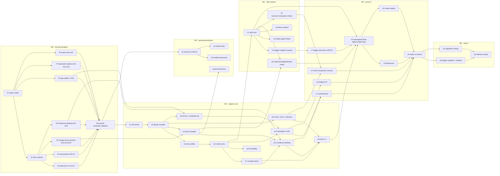

# ADD-SKILL — proposal v4

**The goal, as an end-state of the world (unchanged since v1):** a repo owner drives any
project — a 30-minute fix or a 6-month product — through one skill plus one CLI; resumes it
cold from the bundle alone; trusts every shipped change through a recorded receipt; can see
what the AI did without reading the diff; and pays a token cost proportional to the risk of
the request.

v4 does not move the goal. It closes the gap between *a design that is right on paper* and
*a thing that installs on this machine, survives parallel agents, and lets a human follow
along.*

---

## 0 · Review verdict — what this pass checked, and what it changed

### 0a · Carried forward, re-confirmed

v3's evidence base was re-derived from the live `../AIDD-Book` tree and confirmed line by
line (engine 9,058 LOC · `SKILL.md` 178 lines · both hypotheses REFUTED · per-milestone
costs · 612 vs 268 turns · 188k vs 135k context/turn · specify+scenarios+contract = 3% of
tokens while tests 34% + verify 30% = 64% · guide-only features at 0% adoption). **None of
it is re-litigated here.** v3's four OKF defects (D1–D5) are also confirmed landed in
`FORMAT.md` v1.1-draft.

Live state, OBSERVED this session:

| check | result |
|---|---|
| `python3 scripts/validate_bundle.py .add` | **exit 0** — 20 nodes · 50 edges · 0 info · 0 error · CONFORMS |
| `python3 -m pytest tests/ -q` | **14 passed** in 0.57s |
| M0 task states | all 10 at `verify` — every rule written, **zero gated** |
| git | **no commits yet** — see R11 |

### 0b · Eleven findings from this pass

Each is checked, not preferred. Each acquires an owner in §6.

| # | finding | evidence | lands as |
|---|---|---|---|
| **R1** | **The ATG citation was never audited.** v3 applied methodology rule 7 ("verify the standards you profile") to OKF and skipped the second standard. Fetched: ATG §3 defines a node as `v_j = (i_j, f_j, o_j)` where *"f_j ∈ 𝒯 is the selected tool"* — a node is **one concrete tool call**, not a work item with a frozen interface. §4.3 defines *Minimal Necessary Subgraph Repair*: locate the smallest ancestor, *"repair only this subgraph"*. FORMAT.md's "node = *(needs, work, gives)*; repair replaces a node's internals while preserving its external interface" is a **stronger ABF rule**, not ATG's | WebFetch of arxiv 2607.01942 §3, §4.1, §4.3 | **A19** — cite §3 for the triple and §4.3 for minimal-subgraph repair; declare the *frozen external interface* an ABF extension in the §12 ledger. Extends `f7` |
| **R2** | **Skill-name collision.** `~/.claude/skills/add/` already exists on this machine and is AIDD 2.5's skill (`name: add`, 10 flat references). Installing ADD 3.0 as `add` **overwrites a live install** proven on real projects | `ls ~/.claude/skills/add` + its `SKILL.md` frontmatter | **D-7** identity contract + `d1`. Route by `abf_version` |
| **R3** | **`log.md` is the last shared mutable file**, and it duplicates facts already stamped in node `verified[]`. Under L-E (N subagents in N worktrees) every worker appends to the same file — a merge conflict per wave, or a lost write in-tree. It is also the only bundle artifact authored where it could be compiled | design audit against §4f + L-E | **A20** — `log.md` becomes **compiled** from `verified[]` + `generated.at`, with a preserved human `## Notes` block. Extends `f5` |
| **R4** | **Nothing tests whether the skill fires.** All of M4 assumes the skill is already loaded. Lesson #2 one altitude up: a skill the runtime never activates has 0% adoption no matter how good `next:` is | gap in v3 §7 | **`v7 eval-trigger-precision`**, runs *before* `v0` |
| **R5** | **Mid-session context loss is unowned.** v3 specifies cold resume (new session) but not compaction — the case that actually happens inside a long milestone. "Context rot protection" is a named core value with no mechanism at this altitude | gap in `s5` / `v2` | a SKILL.md rule + `s5` + `v2` extended to post-compaction resume |
| **R6** | **Milestone re-scoping has no protocol.** Frozen-`gives` evolution is specified (§3.5); a *milestone* whose scope the human changes mid-flight is not. This is the user's stated weakness #2 ("hard to change scope when version or state changes") at the milestone altitude | gap in FORMAT §3.2 | **A21** — `amended:` stamp, tasks to `status: dropped` with a reason, EXIT append-only, dependents flagged stale. Extends `f9` |
| **R7** | **A17 pins the floor upward; nothing nudges downward.** Under-classification is pinned mechanically by path match. Over-classification — paying deep ceremony for a one-file mechanical change — has no mechanism, only hope, and it is the failure that made 2.5 expensive | asymmetry in A17 | **E8 · lane advisory** — advisory only, so L3 holds. Extends `e6`/`e9` |
| **R8** | **The human cannot follow work in flight.** The user's fifth named 2.5 weakness ("user experience on gate or follow AI working") is served at the *gate* (C10) and at *close* (E4) and nowhere in between | user goal 13 vs v3 §4a | **E9 · `status --since <ref\|date>`**. Nearly free once A20 lands. Extends `e6` |
| **R9** | **M4's own cost is unbudgeted**, and `v4 eval-scope-regime` at n≥3 across two arms and two scope regimes is the single most expensive item in the plan — on 2.5's own per-milestone numbers, ≥$110 for that task alone | benchmark L159–164 applied to §7 | an eval budget + a pre-registered task set, §7 |
| **R10** | **The dogfood bundle already rotted, in one day, by hand, at 20 nodes.** Three stale facts, all OBSERVED: `specs/system.md#Now` says *"15 verbs"* (D-2 ratified **10**); `index.md`'s compiled TOC says `build-worked-example` is `todo` (the node says `verify`); that task's `EVIDENCE` says *"18 nodes · 48 edges"* (live scan: **20 · 50**). Not sloppiness — the exact failure A11 and E6 predict, arriving faster than predicted | three greps + one validator run | **E10 · `doctor --sync` recompiles index + log and reports `spec_stale`**; and the strongest available argument for law **L7** |
| **R11** | **Zero commits.** `specs/system#Decisions that bind` says *"Git is the transaction log and the rollback. The engine ships no `undo`."* In a repo with no commits, that rollback story is an assertion with no history behind it, and C5's git-progress read has never run against real data | `git log` → *"does not have any commits yet"* | commit M0; `v5 dogfood-ci` asserts it |

**What did not change:** the goal, the three beats, the five specs, the authority ladder, the
depth dial, the cost model, the 10-verb surface, one-artifact packaging, and every A1–A18
amendment. v4 is additive to v3 — exactly as A13 requires of the format it describes.

---

## 1 · Goal, non-goals, regime

### The goal, decomposed into what must be true

| # | end-state | falsified by |
|---|---|---|
| G1 | One artifact installs the method; the agent runs the engine with nothing else installed | any install step beyond dropping the directory in place |
| G2 | A cold agent, given only the skill, drives direction → build → verify with no wrapper | `v0` adherence below the §7 bar |
| G3 | Every shipped change carries a recorded, fresh, **check-bound** receipt and a named authority | a gate that passes with no receipt, a stale receipt, or a `covers:` key no test satisfied |
| G4 | Resume after two weeks — or after a compaction — costs one command plus one node read | any resume that re-reads the repo |
| G5 | Ceremony is proportional to risk, and the cheap lane is *chosen*, not merely available | `v3` shows the quick lane unused where eligible |
| G6 | The five specs fit a wide range of domains without changing the lens set | a profile that needs a sixth lens |
| G7 | The method still works with the engine unavailable, at reduced convenience | any rule that cannot be honoured by hand-editing files |
| **G8** | **A human can see what the AI did, mid-flight, in one command and under a minute** | a human who must read the diff to answer "what happened since I last looked?" |

G8 is new in v4. It is the user's fifth named 2.5 weakness, and it had no end-state until now.

### Non-goals, stated so they stop costing design effort

- **Not a correctness upgrade.** Six benchmark milestones, including one built to find terrain
  where ceremony wins, say a good spec-first alternative reaches the same answers.
- **Not cheapest.** 64% of ADD's tokens are the trust block; that block *is* the product.
- **Not universal.** A one-off script is better served by vanilla. The skill says so out loud.
- **Not a migration target for 2.5 bundles** in v1 — but 2.5 bundles must keep working (R2).

### The regime statement (verbatim in `SKILL.md` and in the published description)

> Use ADD when a change needs to be *trusted later*: a shared codebase, a contract other
> work depends on, a project you will return to cold. ADD ran at **half** the price of a
> spec-first alternative on small increments against an established codebase, and **3–4×**
> its price on large greenfield milestones. If nobody will ever ask "why is this correct?",
> ADD is the wrong tool.

---

## 2 · Methodology and the laws

### How this project is run

1. **Distil, don't rewrite.** 2.5's core (3 beats · 5 specs · freeze/gate · personas ·
   learning loop) is proven and kept verbatim in meaning. Only the *machinery* changes.
2. **Format first.** The engine compiles against the format; a format change after M1
   invalidates written code. One session of format work buys a stable M1.
3. **The engine is a notary and a compiler, never a judge.** It records, validates and
   compiles. Judgment lives in the skill and the personas.
4. **Every budget is a tested number.** A budget nobody counts is a wish.
5. **Dogfood from M1.** This repo's `.add/` runs on the engine we ship.
6. **Red/green TDD on every verb.** A check that never failed for the right reason proves
   nothing.
7. **Verify the standards you profile.** Every external spec claim carries the section it came
   from, and M0 checks it against the source text. D1–D5 are what happens when this rule is
   absent for a day; **R1 is what happens when it is applied to only one of two standards.**
8. **Ship the smallest surface that carries the law.** A capability becomes a flag rather than
   a verb, and a compiled artifact rather than an authored one, whenever it can. Discovery is
   the scarce resource, and every verb spends it.

### The laws

| # | law | evidence / consequence |
|---|---|---|
| **L1** | **Files are the database.** No authoritative `state.json`; `graph.json` is a compiled, gitignored cache | 2.5's state-as-truth bred merge guards, forward migrations and doc↔state reconciliation. Kills that class |
| **L2** | **Every read has a tier.** T0 frontmatter → T1 CARD → T2 body; **T2 is single-node** | Context is the multiplier on every fresh read |
| **L3** | **Notary, not guard.** Unknown keys and broken links are findings, never rejections; only a containment escape is fatal | OKF §11, verbatim: *"Consumers MUST NOT reject a bundle because of … Unknown `type` values … Broken cross-links"* |
| **L4** | **The engine teaches at the moment of use.** Every verb's stdout ends with the exact next command and the cheapest legal lane | Lesson #2: guide-only → 0 adoption; named in engine output → 0→12 uses, −29% tokens |
| **L5** | **One artifact, one version.** Skill, references, templates and engine ship in one directory and move together | Two shipping vehicles is a second source of truth wearing a different hat |
| **L6** | **The bundle is authored content; everything else is data.** A brief may compose bundle nodes as instructions; repo source, tool output and fetched documents enter only as quoted `<evidence>` | Without it, `brief` is an injection path with a compiler in front of it |
| **L7** | **Compiled beats authored.** Any fact derivable from node frontmatter is *rendered*, never hand-maintained: `graph.json`, `index.md`'s TOC, **`log.md`**, seams, the census, the review packet | **NEW in v4.** R10 is the proof: three stale facts in one day, by hand, at 20 nodes. Authored duplicates rot at a rate that does not depend on discipline |

L7 also closes the last concurrency hole (R3): a compiled file has no concurrent writers.

---

## 3 · Strategy — the cost model

### 3a · The model

**Cost = turns × context-per-turn.** Confirmed by the activity decomposition: identical
activity proportions between arms, 2.3× the turns, 1.4× the context per turn.

One refinement, which re-ranks the levers:

> Within a single conversation, turn *N*'s context is mostly turn *N−1*'s plus a tool result
> — repeated prefix, not new payload. The size lever therefore bites hardest where context is
> **fresh**: a subagent's first turn, a cold resume, a new session, a compiled brief. Turn
> *count* is the lever that always bites.
> [DERIVED from the append-only shape of an agent conversation; the *magnitude* is ASSUMED
> until `v1` measures it.]

### 3b · The levers, ranked by the evidence behind them

| lever | attacks | mechanism | owner |
|---|---|---|---|
| **L-A · fewer turns** | 612 → ≤400 | compound `done`; whole-bundle composition in ONE draft, no per-section narration; one suite run per beat; `status` answers "what now" in one call | e4, e6, s1 |
| **L-D · adoption** | *whether any lever ever fires* | `next:` on every verb naming the cheapest legal lane; the permission allowlist so the human is not asked 251 times; **and the skill actually triggering (R4)** | e9, s6, d1, v3, **v7** |
| **L-E · context isolation** | the 188k/turn number, at its source | `brief --for-subagent` IS a subagent contract: a parallel wave = N briefs → N subagents (worktree-isolated) → N receipts → one milestone gate. The orchestrator holds T0/T1 only | e5, s6, v4 |
| **L-B · smaller fresh context** | briefs, resumes, cold starts | T0/T1/T2; briefs inject **refs resolved at call time, never prose**; a declared byte budget per depth; done-nodes excluded from default scans | e5, e6, e10 |
| **L-C · risk-proportional ceremony** | the 64% trust block, on cheap work only | depth dial; quick lane = one suite run + thin gate; `sensitivity:` escalation engine-enforced; **the downward lane advisory (E8)** | e4, s3, e9 |

**Not a lever:** writing fewer specs. Specify + scenarios + contract is **3%** of tokens;
cutting it costs the fidelity floor and buys nothing. This ban is permanent.

**Honest ceiling:** on a milestone that earns full ceremony, ADD will not reach a spec-first
alternative's token cost and must not claim it. The target is parity on short scope and a
bounded penalty on long scope.

### 3c · The scope penalty — the one number that must move

Cost tracks milestone **scope**, not milestone **count** (the pilot retracted its own
"falling curve" claim). ADD's slope against scope was 3–4× the alternative's, and the
mechanism in the benchmark's words is *"full specification bundles + per-task ceremony over a
now-large codebase."* Four mechanisms attack it:

| mechanism | what it removes from a 10-task milestone |
|---|---|
| `## GROUND` gathered ONCE (A8) | N tasks re-reading the same shared code → 1 gather, N projections |
| refs-not-prose briefs + tiers (L-B) | the fresh-context cost, multiplied across every task |
| one-draft composition + one suite run per beat (L-A) | the turn fragmentation engine round-trips cause |
| subagent fan-out (L-E) | the orchestrator's context stops growing with *task* count; it grows with *milestone* count |

**Falsifiable target (`v4`):** keep the small-milestone advantage (≈0.5×) and cut the
large-milestone penalty from 3–4× to **≤1.5×**. A miss narrows the claimed regime; it never
restates the claim more confidently.

### 3d · Ceremony budgets by lane

Budgets are **targets asserted mechanically in `v1`**, not measurements. Every `brief` prints
its budget and its actual.

| lane | engine calls | brief budget | turns (target) | human approvals | example |
|---|---:|---:|---:|---:|---|
| **quick** | **1** (`add done`) | ≤ 2k tok | 3–6 | 0 (auto on a green, covers-bound receipt) | rename a flag; add a log line; fix a typo'd constant |
| **standard** | ≤ 3 (`new`·`freeze`·`gate`) + 1 `run` | ≤ 6k tok | 12–20 | 0–1 (1 if `sensitivity` ≥ data) | add an endpoint field with validation |
| **deep** (per task) | ≤ 3 + 1 `run` | ≤ 10k tok | 20–35 | 1 (human freeze, always) | change an auth contract |
| **deep milestone** (8 tasks) | ≤ 30 total | — | ≤ 160 | 1 ratify + 1 close | ship an auth layer |

For calibration: 2.5's WM1 census was **251 engine calls**. The milestone budget is a **≥8×
cut**, and it is counted, not sampled.

What each lane refuses to pay for:

- **quick** refuses: RULES/PLAN/LESSONS sections, a freeze round-trip, a persona body read.
- **standard** refuses: milestone strategy, human round-trips, re-grounding (it projects from GROUND).
- **deep** refuses nothing — it is the lane that earns the trust block.

### 3e · The token method by project kind (user goal 4)

The lane table above is domain-neutral. The *distribution* of lanes is not, and this is what
`references/token.md` teaches, with one worked example per profile:

| profile | where the tokens actually go | the lever that pays most | typical lane mix | worked example shipped |
|---|---|---|---|---|
| `api-service` | contract detail + integration tests | GROUND once per milestone (A8) — endpoints share models, middleware, fixtures | 20 quick / 60 standard / 20 deep | "add a field with validation" (standard, 6k brief) |
| `ui-app` | visual and interaction verification, which resists a receipt | the depth dial — most UI work is `quick`; escalate only on state or data flow | 55 / 35 / 10 | "add an empty state" (quick, 1 call) |
| `library` | public API surface + backward compatibility | frozen `gives:` — the API *is* the interface, so refreeze is the expensive event; freeze carefully, once | 15 / 50 / 35 | "add an optional parameter" (deep — it is an API change) |
| `cli-tool` | verb surface + output contract | one-draft composition — a verb is small and whole; fragmenting it is pure turn cost | 30 / 55 / 15 | "add a flag to an existing verb" (standard) |
| `data-pipeline` | schema/contract correctness + backfill risk | the sensitivity floor — `data` pins to `plan`, so batch approval through ratification instead of per task | 10 / 45 / 45 | "add a derived column" (standard, `sensitivity: data`) |
| `doc` | almost nothing; the content *is* the deliverable | the quick lane by default — a doc change with no code scope has no receipt to earn | 80 / 20 / 0 | "correct a stale section" (quick) |

The pedagogy is the point. The skill does not say "use fewer tokens"; it says **which lever is
load-bearing in your kind of project, and what a right-sized request looks like there.**

---

## 4 · Feature tables

### 4a · The SKILL (judgment layer)

Budget: `SKILL.md` **≤ 200 lines** (2.5 ships 178 and it works; v1's "≤500" was a 2.8× bloat
mislabelled as a cut) plus **6 references** in `references/`, loaded on demand.

| feature | what it does | freedom | ref |
|---|---|---|---|
| Trigger surface | `name` + `description` + **when NOT to use** + the regime statement; the only always-loaded text (~100 words). **Routes 2.5 bundles away (R2)** | low | — |
| Intake sizing | classify the request → `quick` / `task` / `milestone` / `change-request` *before* any scope exists; sets `depth` and `sensitivity` | medium | `intake` |
| 3-beat loop | DIRECTION (rules + plan + red checks → ONE freeze) → BUILD (green, scope-fenced) → VERIFY (receipt → gate) | high | `loop` |
| Quick lane | one-call `add done`; security / data / architecture auto-escalate | low | `intake` |
| Authority ladder | who may freeze: `human` · `plan` · `ai-verify` · `process`; `sensitivity` pins the floor; `sensitive_paths:` pins it harder | low | `loop` |
| **Human-gate contract** | exactly what a freeze/gate request shows a human: goal · `gives` · the check list · the ONE riskiest assumption and its cost · the cheapest legal alternative. **≤15 lines, decidable in 30 seconds.** An approval a human cannot evaluate in 30 seconds is a rubber stamp, and a rubber stamp is a forged receipt | low | `loop` |
| **Follow-along contract** (new, G8) | what `status --since` shows and when to offer it: gates since the mark, receipts and their verdicts, files touched, approvals waiting, deltas opened | low | `loop` |
| Reasoning arc | fable-thinking distilled to ~40 lines: the Floor at intake (goal as an end-state, never the request's framing), claim tags, the refute pass at the gate | high | `loop` |
| Token method | turns × context; T0/T1/T2; the §3d budgets; **the §3e per-profile method**; what each lane refuses to pay for | medium | `token` |
| Resume | cold start = `add status` (T0) + one node at T2 + git progress. **After any context loss — compaction included — re-orient before acting; never re-read the repo (R5)** | low | `resume-learn` |
| Learning loop | `add learn <lens>` deltas → fold at close → smaller, truer specs each loop | medium | `resume-learn` |
| Persona select→fold→author | reuse a fitting lens; fold near-duplicates; author only when no lens owns the decision; the generic 15-year fallback never lowers a gate | medium | `personas` |
| Runtime & parallelism | invocation path; the permission allowlist; briefs → subagents in worktrees; **hand-mode** when the engine is unavailable | low | `runtime` |

### 4b · The ENGINE (`add`) — 10 verbs

Fewer verbs is a design position, not thrift: 15 verbs grow the discovery surface while citing
the lesson that discovery is what fails. Five became flags — same capability, ~⅓ less surface.

| verb | does | tier | flags |
|---|---|---|---|
| `init` | scaffold the 8-file bundle; seed the 5 specs from a domain profile | write | `--profile <api-service\|ui-app\|library\|cli-tool\|data-pipeline\|doc>` |
| `new <slug>` | create a node from the one template; sections set by `depth` | write | `--milestone` · `--todo` · `--depth` · `--dry-run` |
| `freeze <slug>` | stamp `verified: act: freeze`; freeze `gives:`; refuse when a Must/Reject is in no check; pin the floor on a `sensitive_paths:` match | write | `--by` · `--authority` |
| `run -- <cmd>` | execute **the caller's** command; capture a Run receipt including extracted test IDs and their outcomes; count consecutive reds | write | `--scope` |
| `gate <slug> <verdict>` | record PASS / RISK-ACCEPTED / HARD-STOP; refuse without a fresh receipt; refuse when a `covers:` check is absent from the receipt's passed set; stamp the brief hash | write | `--by` · `--authority` |
| `done <slug>` | quick lane: new + freeze + gate in ONE call | write | `--cmd` |
| `status` | **the resume verb**: active nodes, beat, build progress from git, exact next command, cheapest legal lane, fold nudge, stuck rule, **lane advisory (E8)** | T0 | `--brief` · `--json` · `--graph` · `--find` · `--all` · **`--since <ref\|date>` (E9)** |
| `brief <slug>` | compile the XML prompt pack from refs; enforce the byte budget; emit a subagent-ready contract; deterministic, prints its content hash | read | `--phase direction\|build\|verify` · `--for-subagent` |
| `learn <lens> "<lesson>"` | prepend a delta to one of the five specs | write | `--fold` |
| `doctor` | conformance scan + graph rebuild + orphans + version skew + **compile `index.md`'s TOC and `log.md` (A11/A20)** + `spec_stale` | mixed | `--fix` · `--sync` · `--locate <check>` · `--close <milestone>` · `--census` |

Every write verb takes `--dry-run`. Every verb's stdout ends with a `next:` line (L4).

**Folded from 15:** `todo` → `new --todo` · `find` → `status --find` · `graph` →
`status --graph` · `sync` → `doctor --sync` · `locate` → `doctor --locate`.

**Cut from 2.5:** `migrate` (no second source of truth) · `new-milestone` (merged) · dup-fail
sidecars (the depth dial removes the retry storm they compensated for).

**Budget:** ≤ **2,400** lines, stdlib only, single file. D-6 stands: this budget moved once and
never moves again. v4's additions (compiled log ≈40 · `--since` ≈40 · lane advisory ≈25 ·
`spec_stale` ≈15 ≈ **120 lines**) land inside it, or `--locate` is cut, then `--graph`. Never
a law.

### 4c · Packaging, and the identity contract (R2 / D-7)

```
add/                          # the shipped skill directory — ONE artifact
  SKILL.md                    # ≤200 lines: trigger, regime statement, core loop
  references/                 # 6 files, on demand
    intake.md · loop.md · token.md · resume-learn.md · personas.md · runtime.md
  scripts/
    add.py                    # the engine: stdlib only, ≤2,400 lines, zero deps
    templates/                # task · milestone · spec · project · prompts/*.xml
    profiles/                 # api-service · ui-app · library · cli-tool · data-pipeline · doc
    personas/                 # the 3 method personas
  FORMAT.md                   # ABF-1, shipped so `doctor` and humans cite one text
  plugin.json                 # Claude Code plugin manifest + recommended allowlist
```

| property | consequence |
|---|---|
| The engine ships **inside** the skill | version skew between skill and engine is structurally impossible (L5) |
| Zero install: drop the directory in `.claude/skills/`, or install the plugin | removes the silent adoption tax |
| Python **stdlib only, single file** | works wherever `python3` exists. ⚠ Windows without python3 falls back to hand-mode — stated, not hidden |
| `plugin.json` ships a recommended allowlist | without it, up to one approval prompt per engine call; with it, the lanes cost what §3d says |
| Optional `pipx install add-skill` shim | strictly optional; the in-skill script stays the source of truth, and the clean-machine smoke must pass without the shim |

**The identity contract — a v1.0 blocker, not a packaging nit.** `~/.claude/skills/add/`
already holds AIDD 2.5, in use on live projects. The rule:

1. ADD 3.0 keeps the name **`add`** — it is the brand, and `.add/` is the trigger for both.
2. A 2.5 install is **moved aside, never overwritten**, to `add-legacy/` at install time.
3. Routing is **mechanical, not judgmental**: `.add/index.md` carrying `abf_version:` is a 3.0
   bundle; its absence is a 2.5 bundle. The 3.0 skill's description states this, and `doctor`
   on a pre-ABF bundle prints one line — *"this is a 2.5 bundle; use `add-legacy`"* — and exits
   without touching anything.
4. No migration verb ships in v1 (the clean break stands). Coexistence is the compatibility
   story; conversion is not.

### 4d · Artifacts — how each is generated, and how dynamic it is

| artifact | generated by | when | lifetime | dynamism | who may edit |
|---|---|---|---|---|---|
| `index.md` | `init`; **body TOC compiled by `doctor`** | once + on change | bundle | frontmatter static, **body compiled** (L7) | engine |
| **`log.md`** | **compiled from `verified[]` + `generated.at`, grouped under ISO date headings (A20)**; a `## Notes` block is human-owned and preserved | on `doctor --sync` and every write verb | rotates by whole date groups at milestone close | **compiled** (L7) — was append-only in v3 | engine (+ human in `## Notes`) |
| `PROJECT.md` | `init --profile` | once | bundle | living; the **Voice** section is human-owned | human; AI on the rest |
| 5 specs | `init` from the profile; `learn` prepends deltas; folds at close | continuous | bundle | **self-compacting**: deltas in, folds up | AI + human |
| task / milestone nodes | `new` from ONE template; section set chosen by `depth` | per request | until done, then excluded from default scans | **dynamic shape** (3 or 6 sections) | AI; human may hand-author |
| `graph.json` | `doctor --sync`, incrementally by every write verb | continuous | derived, gitignored | **never authoritative**; gates re-read frontmatter | engine |
| **XML brief packs** | `brief` — refs resolved against the **current** bundle at call time | per beat | **never stored** | **fully dynamic** — this is the fix for hard spec injection | engine |
| **subagent contracts** | `brief --for-subagent` | per parallel task | never stored | fully dynamic (L-E), hash-stamped at the gate | engine |
| Run receipts | `run`, consumed by `gate` | per gate | append-only in `<task>.d/runs/` | attested, immutable | engine |
| spec deltas → folds | `learn`, folded at close | per lesson | absorbed into `Now` | dynamic, self-compacting | AI |
| **milestone census** | `doctor --census`, folded into `CLOSE` | at close | permanent in `CLOSE` | compiled (L7) | engine |
| **review packet** | `doctor --close <milestone>` | at close | rendered, then folded | compiled (L7) | engine |
| **`status --since` digest** | `status --since` from `verified[]` + git | on demand | ephemeral | compiled (L7) | engine |
| personas | the persona-author flow (skill); the engine validates the schema | on demand | project lifetime | dynamic, authored per project | AI + human |
| `status` / graph / `next:` output | `status` | on demand | ephemeral, never stored | rendered | engine |
| domain profiles | authored once as package data | per profile kind | ships with the artifact | static asset | maintainer |

**The dynamism that matters:** a brief is composed of *references*, never copied prose. Edit a
spec's `Decisions that bind`, and every future brief re-scopes with zero prompt edits. That is
the direct answer to *"hard specs injection prompt → difficult to change scope when the version
or state changes."*

**The trust boundary on that composition (L6):** bundle nodes compose as instructions; repo
source, command output and fetched documents appear only inside `<evidence>`, quoted and
labelled with their origin. `brief` enforces the placement; the skill states the rule.

**The rot boundary (L7):** ten of the fourteen artifacts above are compiled. R10 is why — the
four authored ones are the only ones that *can* rot, and they are exactly the four where a
human's judgment is the content.

### 4e · Personas — dynamic, three layers

| layer | ships in the artifact | authored per project | injection |
|---|---|---|---|
| **method personas** | `task-planner` · `milestone-planner` · `release-planner` — they reason about ADD's own artifacts only (2.5's proven shipping criterion) | — | frontmatter (T0) by default |
| **domain personas** | **none shipped.** A preset nobody consumes is noise — 2.5 retired 12 | `select → fold → author`, schema-validated: `name · vibe · flow · use-when · not-when` + Identity / Critical Rules / Default Requirement / Success Metrics | frontmatter; **body only when the decision needs the lens** |
| **generic fallback** | a 15-year specialist in the task's `kind:` | — | inline, ~3 lines; never lowers a gate, never blocks |

**The selection algorithm — the "dynamic" part, made mechanical:**

1. `use-when` match against the task's `kind` + `sensitivity` → candidate set.
2. Exactly one candidate → select it, inject frontmatter.
3. Two or more overlapping → **fold** them into one sharper lens before use; record the fold as
   a delta on `specs/method`. A roster of near-duplicates is worse than one lens.
4. Zero candidates and the decision is genuinely load-bearing → **author** one,
   schema-validated, saved to `personas/`; selectable for the rest of the project.
5. Zero candidates and the decision is routine → generic fallback, no file written.

**Corpus (D-4, ratified):** referenced by path, never vendored. `index.md` may carry
`persona_corpus: <path>`; step 4 scans `personas/` first, then the configured corpus (e.g.
AIDD-Book's `personas-teacher/`), and degrades to the generic fallback when unset or absent.

### 4f · Failure, concurrency, durability

| failure mode | design response |
|---|---|
| Two agents write the same node | atomic single-file replace (tmp + rename). No multi-file transaction exists |
| Two agents write the *same shared file* | **there is no shared mutable file.** `graph.json`, `index.md`'s body and `log.md` are all compiled (L7, A20). This is R3's closure |
| A shared activity pointer is corrupted | there is no pointer — activity is derived from `status:` |
| A gate trusts a stale cache | the cache is never trusted for a gate; gates re-read frontmatter |
| Tests passed before the last edit | receipt freshness: any in-`scope:` mtime newer than the receipt makes it stale, and a stale receipt cannot earn a gate |
| A gate passes on a check nobody wrote | `covers:` is bound to the receipt's observed test IDs; unparseable runner output degrades to a visible `covers_unverified` finding |
| Engine and bundle disagree on version | receipts pin the engine version; `doctor` warns on skew against `abf_version` |
| A destructive verb runs by mistake | `--dry-run` on every write verb; a path-safe slug charset |
| Something must be undone | git is the transaction log; the engine ships no `undo` — **and M0 gets committed, so this stops being an untested claim (R11)** |
| The journal grows unbounded | rotation by whole date groups at milestone close, folded into `CLOSE` |
| Raw stdout leaks into a receipt | receipts record structured fields, never raw output |
| **Build interrupted mid-session** | `status` reports progress from `git status --porcelain` ∩ the task's `scope:` — read-only, no new state: *"build in progress: 3/5 scope files modified, no receipt yet"* |
| **Context compacted mid-milestone** | the skill's first rule after any context loss is `add status`; the node's CARD is the recovery anchor; the repo is never re-read (R5) |
| **Engine unavailable** | **hand-mode**: every rule is honourable by editing files. `doctor` is the only verb whose absence costs correctness, and it can run later. `runtime.md` carries a 15-line hand-mode card |
| **Bundle grows to hundreds of nodes** | default scans exclude `done\|dropped`; `status` prints ≤20 node lines plus a count; `--graph` renders one milestone at a time |
| **Format evolves** | additive-only within a major `abf_version`; a removal or semantic change is a major bump shipping a `doctor --fix` migration |
| **The human changes a milestone's scope mid-flight** | **A21:** an `amended:` stamp records who, when and why; dropped tasks become `status: dropped` with a reason and keep their nodes; EXIT criteria are append-only; dependents citing a dropped `gives:` are flagged stale (R6) |
| **A brief composes hostile content** | non-bundle content enters only as quoted `<evidence>`; `brief` refuses to inline a file outside `.add/` as instruction |
| **Approval-prompt storm** | the allowlist ships in `plugin.json`; `status` names it in `next:` when repeated interactive denials are detected |
| **The skill never fires** | `v7` measures trigger precision and recall before anything downstream is measured (R4) |

### 4g · Harness interop

| surface | contract |
|---|---|
| **Skill invocation** | triggers on the description; also `/add` as a user-invocable command. A 2.5 bundle is routed to `add-legacy` (R2) |
| **Permissions** | a shipped allowlist for the engine's own invocation only. `add run -- <cmd>` still surfaces the user's test command for approval — correct, because that *is* the execution |
| **Subagents** | `brief --for-subagent` emits a complete, self-contained prompt (objective · persona · refs resolved · constraints · required evidence · close command). Parallel waves: N subagents, worktree isolation, one receipt each, one milestone gate |
| **Plan mode** | intake classifying a request as `milestone` maps to plan mode; the ratified plan becomes the milestone's `ratified:` stamp at authority `plan` |
| **Native task list** | the bundle is the durable list; the harness's ephemeral list mirrors only the *current* task's checks and is never read back (L1) |
| **Git** | the engine never commits. It reads `git status` for progress and `git log` for `--since`. Commits stay the human's or the harness's call |
| **Compaction** | the bundle survives it by construction; the skill's re-orientation rule makes recovery one command |

---

## 5 · Format amendments

**A1–A18 are landed** in `FORMAT.md` v1.1-draft and are not restated here: the authority
ladder + sensitivity floor + bounded ratification (A1) · receipt freshness (A2) · the engine
records but never executes (A3) · log rotation (A4) · brief budget with loud degradation (A5) ·
the `next:` affordance contract (A6) · fragment-resolver proof (A7) · milestone `## GROUND`
(A8) · OKF citation repair (A9) · date-grouped log (A10) · compiled index TOC (A11) · scale
rules (A12) · the compatibility contract (A13) · the injection trust boundary (A14) · evidence
binding (A15) · brief determinism and hash (A16) · the sensitive-path floor (A17) · the census
in `CLOSE` (A18).

**New in v4 — A19–A21:**

| # | amendment | why | owner |
|---|---|---|---|
| **A19** | **ATG citation repair.** Cite §3 for `v_j = (i_j, f_j, o_j)` and note that ATG's node is *one concrete tool call*; cite §4.3 for *Minimal Necessary Subgraph Repair*; add a §12 ledger row declaring **the frozen external interface** an ABF extension ATG does not define | R1. Methodology rule 7 applied symmetrically. A validator built on a mis-cited spec certifies nothing — and so does a format built on a mis-read paper | `f7` (renamed `align-standards-citations`) |
| **A20** | **`log.md` is compiled, not appended.** Entries render from node `verified[]` stamps and `generated.at`, grouped under ISO `## YYYY-MM-DD` headings, newest first. A trailing `## Notes` block is human-owned and preserved verbatim across recompiles. Rotation (A4) moves whole rendered groups into `CLOSE` | R3 + L7. Removes the last shared mutable file, so parallel subagents in worktrees cannot conflict; and every log line now traces to a stamp on a node, which is what makes it evidence rather than narration | `f5` |
| **A22** | **Content-addressed receipt freshness.** In a git repository, a receipt records the blob hash of every file in the task's `scope:` at run time; freshness is a hash comparison, not a timestamp comparison. `mtime` remains the fallback outside a git repo, and a receipt records which predicate it used | **P2, empirically confirmed.** FORMAT §8.1 already flagged mtime as the one assumption it expected to replace, and isolated the predicate for exactly this. The replacement is now due | `f3` |
| **A23** | **Compiled artifacts declare their regeneration.** `init` ships a `.gitattributes` marking `index.md` and `log.md` as engine-generated; the documented merge resolution is `doctor --sync`, never a hand-merge; `graph.json` stays gitignored | **P3.** D-8 removed concurrent-writer conflicts inside a worktree and did nothing about merge conflicts between branches — a compiled file that is committed still collides | `f9` |
| **A24** | **Evidence kinds.** `covers:` binds to an *observation*, and a test ID is only one kind of observation. A receipt declares its `kind:` — `test-ids` · `command-exit` · `artifact-hash` · `human-observed` — each with its own binding rule and its own honesty about what it does and does not prove | **P5.** A15 defined evidence as parsed test IDs. In the `doc` and `ui-app` profiles there is often no runner, so `ids: unknown` would become the normal case and `covers_unverified` a finding nobody reads — the exact silent-degradation failure A15 exists to prevent | `f10` |
| **A21** | **The milestone amendment protocol.** A scope change records `amended: { by, at, authority, reason }`; removed tasks move to `status: dropped` with a reason and keep their nodes; `EXIT` criteria are append-only (struck, never deleted); any node whose `needs:` cite a dropped task's `gives:` is flagged **stale** and must re-verify before its next gate | R6. Frozen-`gives` evolution was specified at the task altitude and nowhere at the milestone altitude — which is where a human actually changes their mind | `f9` |

---

## 6 · Plan — milestones, tasks, DAG

### Milestones, each with its goal (user requirement 10)

| id | slug | goal (end-state) |
|---|---|---|
| **M0** | `format-standard` | ABF-1 + A1–A21 ratified, **every external standard claim checked against its source text**, and a worked example bundle that validates every rule *by existing* — a validator exits 0 on it |
| **M1** | `engine-core` | All 10 verbs green under red/green TDD, ≤2,400 lines, shipped **inside the skill directory**, and this repo's `.add/` runs on it (dogfood begins) |
| **M2** | `skill-surface` | A cold agent, given only the skill text, runs intake → quick lane → standard task end-to-end without reading engine source — including in a subagent, after a compaction, and with the engine absent |
| **M3** | `personas-prompts` | Three method personas + the XML prompt library + the persona-author flow, all schema-validated by the engine |
| **M4** | `prove-it` | The skill **fires** when it should; `v0` passes its bar within the stop rule; ceremony budgets, cold and post-compaction resume, approval-prompt counts and lane choice are asserted mechanically; the scope-regime claim is measured at n≥3 inside a stated eval budget |
| **M5** | `ship-it` | Installable as a Claude Code plugin with the allowlist and the **identity contract**, an upgrade path proven by a compat smoke test, and the regime statement in the published description |

### The task list — 42 tasks

**M0 · format-standard (10)** — all ten exist in `.add/tasks/`; three gain scope from v4.

| id | slug | goal | state |
|---|---|---|---|
| f1 | `define-entity-model` | the type vocabulary, layout and slug rules are closed | verify |
| f2 | `define-task-schema` | a task's interface is machine-readable; its repair rule is mechanical | verify |
| f3 | `define-authority-rules` | A1–A3 + A17: a legal headless freeze; no gate on a stale or absent receipt | verify |
| f4 | `define-read-protocol` | A5–A7: every read tiered, every brief budgeted | verify |
| f5 | `define-log-rotation` | A4 + A18 + **A20 (the log is compiled)** | verify · **+A20** |
| f7 | **`align-standards-citations`** (was `align-okf-conformance`) | A9–A11 + **A19**: every OKF *and* ATG claim matches its source or is declared an extension | verify · **+A19** |
| f8 | `define-scale-rules` | A12: scan exclusion, output ceilings, per-milestone graph | verify |
| f9 | `define-compat-contract` | A13 + A14 + **A21 (milestone amendment)** | verify · **+A21** |
| f10 | `define-evidence-binding` | A15 + A16: receipts record test IDs; a gate refuses an unmet `covers:`; red-first is earned; the brief hash is stamped | verify |
| f6 | `build-worked-example` | this bundle conforms; the validator exits 0; all four fragment forms exercised; **the three stale facts of R10 corrected, and the correction committed (R11)** | verify · gate pending human |

**M1 · engine-core (12)**

| id | slug | goal |
|---|---|---|
| e1 | `port-okf-parse` | frontmatter read/write + atomic single-file replace |
| e2 | `compile-graph` | edges, the fragment resolver, `graph.json`, seam derivation |
| e3 | `build-init-profiles` | the 8-file scaffold + 6 domain profile packs |
| e4 | `build-node-verbs` | `new` · `freeze` · `gate` · `done`; depth-conditioned sections; sensitivity escalation; the sensitive-path floor |
| e5 | `build-brief-compiler` | refs→brief, the byte budget, the `--for-subagent` contract, the L6 boundary |
| e6 | `build-orient` | `status` + `--brief/--json/--graph/--find/--all` + git progress + **`--since` (E9)** + **the lane advisory (E8)** |
| e7 | `build-receipts-learn` | `run` receipts, the freshness rule, `learn` deltas, the fold nudge, the consecutive-red counter |
| e12 | `build-evidence-binding` | test-ID extraction (junit-xml, then `-v` node lines), the `covers:`→receipt gate check with its `covers_unverified` degradation, red-first proof, brief-hash stamping |
| e8 | `build-doctor` | scan, `--sync` (**compiles the index TOC *and* `log.md`, A20**), `--locate`, `--fix`, skew, the `--close` review packet, `--census`, **`spec_stale` (E10)** |
| e9 | `build-hints-layer` | L4 — `next:` on every verb naming the cheapest legal lane |
| e10 | `build-durability` | dry-run, concurrency, scale bounds, path-safe slugs |
| e11 | `package-in-skill` | the engine in `scripts/`, run via the skill path, zero deps; the optional pipx shim; a clean-checkout smoke |

**M2 · skill-surface (6)**

| id | slug | goal |
|---|---|---|
| s1 | `write-skill-core` | `SKILL.md` ≤200 lines: 3 beats, lanes, authority, the reasoning arc |
| s2 | `write-trigger-surface` | name + description + **when NOT to use** + the regime statement + **the 2.5 routing line (R2)** |
| s3 | `write-intake-ref` | sizing → depth/sensitivity → lane; the human-gate contract; **the follow-along contract (G8)** |
| s4 | `write-token-ref` | the §3d budgets and the **§3e per-profile method**, one worked example per profile |
| s5 | `write-resume-learn-ref` | cold resume, **post-compaction re-orientation (R5)**, git progress, the delta→fold loop |
| s6 | `write-runtime-ref` | the invocation path, the allowlist, subagent fan-out (L-E), hand-mode |

**M3 · personas-prompts (4)**

| id | slug | goal |
|---|---|---|
| p1 | `define-persona-schema` | the schema + validator + the select→fold→author algorithm |
| p2 | `write-method-personas` | task-planner · milestone-planner · release-planner |
| p3 | `write-prompt-library` | direction/build/verify XML + the subagent variant |
| p4 | `build-persona-author` | the authoring flow + `persona_corpus:` path resolution |

**M4 · prove-it (8 rows, `v6` is the milestone close)**

| id | slug | goal |
|---|---|---|
| **v7** | **`eval-trigger-precision`** | **NEW, runs first.** Does the description fire on in-regime requests (recall) and stay silent on out-of-regime ones (precision)? Includes the 2.5-bundle routing case. **Harness: `skill-creator`'s `scripts/run_eval.py`** — a literal trigger-evaluation runner (*"tests whether a skill's description causes Claude to trigger … for a set of queries"*) with `aggregate_benchmark.py` for variance, shipped in the `anthropic-agent-skills` marketplace copy (the plain `~/.claude/skills/skill-creator/` install does **not** carry it). We write the query set, not the runner. ⚠ `run_loop.py` will optimise a description indefinitely; **D-9's three-revision cap binds it**, or we reproduce the wrapper-tuning asymmetry the pilot flagged against itself |
| v0 | `eval-unwrapped-drive` | **precondition** — with no wrapper, does a cold agent invoke the engine, pick a lane, freeze before building, run checks red first, gate on a receipt? ≥3 reps, under the stop rule |
| v1 | `eval-conformance` | counted, in CI: engine calls per lane · `init` = 8 files · brief bytes ≤ budget · a fresh receipt at every gate · an unmet `covers:` is refused · the same brief hashes identically twice · approval prompts per lane · `doctor` = 0 errors · **a hand-authored bundle validates (G7)** · **`--since` is complete against a known event set (G8)** · **a parallel wave produces no file conflict (A20)** |
| v2 | `eval-cold-resume` | a two-week-cold agent — **and a post-compaction agent** — reconstructs the active node and next action from `status` + one T2 read |
| v3 | `eval-behavioral` | lane choice · quick lane when eligible · refusal to weaken a check · security escalation · acting on the lane advisory; ≥3 reps, rubric |
| v4 | `eval-scope-regime` | small increment vs large milestone against the same established codebase; the 0.5× / ≤1.5× target; ≥3 reps, reported with spread, **inside the §7 eval budget** |
| v5 | `build-dogfood-ci` | `doctor` + validator + engine test suite on every commit of this repo |
| v6 | `ratify-1.0` | fold every delta, close the milestones, ratify or **narrow** the claim |

**M5 · ship-it (3)**

| id | slug | goal |
|---|---|---|
| d1 | `build-plugin-manifest` | `plugin.json` + allowlist + skill metadata + **the identity contract (R2/D-7)** |
| d2 | `prove-upgrade-path` | compat smoke: a 1.0 bundle under a 1.1 engine, the `--fix` path, **and a 2.5 bundle routed away untouched** |
| d3 | `release-smoke` | clean-machine install → `init` → quick lane → gate, with no other install step and no pipx |

### The DAG



**Critical path:** `f1 → f2 → f3/f9 → f6 → e1 → e2 → e4 → s1 → s2 → v7 → v0 → v3 → v6 → d3`.

`v7` and `v0` sit on the critical path deliberately: `v7` tests whether the skill is ever
loaded, `v0` tests whether it can drive the loop once loaded. Every other M4 number inherits
both assumptions, so both run **before** them, not beside them.

**Sequencing:** M0 (~1 session, mostly done) → M1 (3–4 sessions, TDD, the bulk) → M2 ∥ M3 (1–2
each) → M4 (1–2) → M5 (1). M2 and M3 are worktree-parallel once M1 is green — §4f guarantees no
shared mutable state, and this is the project's own first use of L-E.

### Is the task list enough? — the sufficiency argument

**Every user goal has an owner:**

| user goal | owned by |
|---|---|
| 1 distil, keep the core, stay simple | §2 methodology · 10 verbs not 15 · `s1` (≤200 lines) · one artifact |
| 2 five specs flexible across domains | FORMAT §5 profiles · `e3` · §3e · `v4` |
| 3 XML prompts, dynamic per task | FORMAT §7 · `e5` · `p3` · A14/A16 |
| 4 a token method with examples per project kind | §3 cost model · §3d budgets · **§3e per-profile table** · `s4` · `v1` |
| 5 evidence, and learning for the next loop | A2/A3/A15 · `e7` · `e12` · `s5` |
| 6 CLI graph state, OKF, resume anytime, ATG | FORMAT §1–3 · `e1`–`e2` · `e6` · `e8` · `v2` · **A9 + A19 — both standards now checked** |
| 7 good for short **and** long horizons | the depth dial (`s3`, `e4`) · `v1` (short) · `v4` (long) · A12 (scale bounds) |
| 8 project → milestone → task, simple | FORMAT §1–2 · flat `tasks/` · milestone-less quick tasks · **A21 (re-scoping)** |
| 9 slugs easy to look up | FORMAT §1 (slug = filename stem) · `status --find` |
| 10 goals on project and milestone | `goal:` is a **required** frontmatter key on Project, Milestone and Task |
| 11 durable, maintainable, live | L1 · L7 · §4f · A13 · A12 · `doctor` · receipts · git |
| 12 the engine does the common work | §4b · `e9` makes it discoverable · the allowlist makes it usable |
| 13 the human can understand and follow AI work | **G8** · the human-gate contract · **E9 `status --since`** · E4's review packet · A20 (a log that traces to stamps) |

**Every ADD 2.5 weakness has an owner and an assertion:**

| the weakness you named | mechanism | asserted by | status |
|---|---|---|---|
| heavy token/time consumption | L-A · L-B · L-C · L-E; the trust block is kept, everything around it shrinks | `v1`, `v3`, `v4` | MITIGATED — bounded, not eliminated; the 64% is the product |
| hard specs-injection prompt; hard to change scope on a version or state change | refs-not-prose briefs (`e5`) · frozen-`gives` refreeze · **A21 milestone amendment** | `v1` (brief bytes; hash determinism) | **CLOSED** |
| ceremony tool calls per turn → reasoning cost | 10 verbs · `done` (1 call) · `status` answers "what now" once · a milestone budget of ≤30 vs 2.5's 251 | `v1` (engine-call census) | **CLOSED by budget, pending measurement** |
| low benchmark result vs spec-kit / vanilla on short scope | the quick lane; the regime statement that says when *not* to use ADD | `v1` + `v3` | MITIGATED |
| user experience on gates / following AI work | **G8**: the human-gate contract (≤15 lines, 30 seconds) · `status --since` · the `doctor --close` packet · a log that traces to stamps | `v1` (`--since` completeness), `v3` (rubric) | **CLOSED by design, pending measurement** |
| *(v3)* install friction / version skew | one artifact, one version (L5) | `d3` | CLOSED by construction |
| *(v3)* approval-prompt storm | the shipped allowlist | `v1` (prompt count) | MITIGATED |
| *(v3)* unverified OKF claims | A9–A11 | `f6` | CLOSED |
| *(v3)* `covers:` was a label, not a binding | A15/A16 | `v1` | CLOSED where IDs parse, visible where they don't |
| *(v4)* unverified ATG claims | **A19** | `f6` | CLOSED |
| *(v4)* the last shared mutable file | **A20 + L7** | `v1` (parallel-wave smoke) | CLOSED |
| *(v4)* the skill may never fire | — | **`v7`** | MEASURED, not assumed |
| *(v4)* installing overwrites a live 2.5 skill | **D-7 identity contract** | `d2` | CLOSED |
| *(v4)* authored duplicates rot in a day | **L7** | `e8` (`spec_stale`), `v5` | MITIGATED |
| *(P1)* the affordance chain had no first link — nothing caused the first engine call | **§12 proactive layer** (E12) | `v7`, `v0` with the hook disabled as the control | MITIGATED, and falsifiable |
| *(P2)* every committed receipt reads stale in a fresh checkout | **A22** content-addressed freshness | `v1` in CI on a clean clone — the case that would have failed every run | **CLOSED once A22 lands** |
| *(P3)* compiled artifacts still collide at merge | **A23** | `v1` (parallel-wave merge smoke) | MITIGATED |
| *(P5)* evidence meant test IDs, so two of six profiles degrade by default | **A24** evidence kinds | `v1` (a `doc`-profile gate with a non-test evidence kind) | MITIGATED |

**Minimality.** Removing any task drops a goal, a law or an assertion. v4 adds exactly one task
(`v7`) and extends five (`f5`, `f7`, `f9`, `e6`, `e8`) — because every other finding lands as
behaviour or a flag, which is methodology rule 8 holding under pressure.

**What would tell us this list is wrong** (stated so the plan is falsifiable):

- **`v7` fails** → the skill is not discoverable, and no amount of `next:` polish helps. The
  response is a description rewrite under its own three-revision cap, not more tasks.
- **`v0` fails three times** → the skill cannot carry the loop unwrapped. The correct response
  is to **narrow the product** to *format + engine + a human-driven method*, not to add tasks.
  That deletes M4's remaining evals and changes M5's claim.
- **The engine passes 2,400 lines before `e8`** → drop a verb, never a law. First cuts:
  `--locate`, then `--graph`. The budget moved once (D-6) and does not move again.
- **A profile needs a sixth spec lens** → the closed-lens claim (goal 2) is wrong and M0
  reopens. Watch this at `e3`.
- **`ids: unknown` becomes the common case** in real runners → evidence binding degrades to a
  finding nobody reads, and A15's central claim needs a different mechanism. Watch at `e12`.

---

## 7 · Evaluation design

**Conformance is counted. Behaviour is sampled at n≥3. Cost is directional, with spread.** The
pilot documents 8× run-to-run token variance and a complete fidelity flip (0.0 vs 0.98) on a
rerun at n=1. A single-run token delta is noise wearing a number.

| track | asserts | reps | verdict |
|---|---|---:|---|
| **v7 · trigger precision** (gate-0) | in-regime requests load the skill; out-of-regime ones do not; a 2.5 bundle routes to `add-legacy` | ≥10 prompts per class | **gates all of M4** |
| **v0 · unwrapped drive** (precondition) | with ONLY the skill — no wrapper, no loop-driving prompt, no proxy authority — the agent invokes the engine, picks a lane, freezes before building, runs checks red first, gates on a receipt | ≥3 | **gates v3/v4** |
| **v1 · conformance** (deterministic, CI) | the counted list in §6 | 1 | pass/fail |
| **v2 · resume** | reconstruct the active node + next action from `status` + one T2 read, after a simulated two-week gap **and after a compaction** | ≥3 | rubric |
| **v3 · behavioural** | right lane? quick lane when eligible? refuses to weaken a check? escalates `sensitivity: security`? acts on the lane advisory? | ≥3 | pass-rate |
| **v4 · scope regime** | small increment vs large milestone on the same established codebase — the 0.5× / ≤1.5× target | ≥3 | reported with spread |

### The stop rule

> `v0` may be re-run after **at most three** skill/hints revisions. The pilot's own fairness
> digest flags that ADD's wrapper was tuned across three iterations while the comparison arm got
> none; three is the ceiling that keeps us honest by the same standard we criticised. If
> adherence is still below bar after the third revision, ADD ships with a **narrowed claim** —
> *"a format, an engine, and a method a human drives"* — and the skill's description says so.
> Narrowing is a result, not a failure.

The same cap applies to `v7` (description revisions), for the same reason.

### The eval budget (new — R9)

M4 is the most expensive milestone in this plan, and until now it was the only one with no
budget. On 2.5's own per-milestone figures, `v4` alone — two arms × two scope regimes × n≥3 —
is **≥ $110**, larger than M0 and M2 combined.

| rule | value |
|---|---|
| Total M4 budget | **$250**, tracked by the census the engine already produces (A18) |
| Task set | **pre-registered before the first run** and published in `v4`'s node — no post-hoc selection of favourable milestones |
| Overrun behaviour | report the small-scope regime at n≥3 and the large-scope regime as **"directional, n<3"**, labelled as such in every table it appears in. Never silently reduce n |
| Arm fairness | the comparison arm gets the same prompt-tuning allowance ADD gets — the asymmetry the pilot flagged against itself |

---

## 8 · Risks, and what v4 makes worse

### Weakest links, stated in the delivery

1. **Adoption without an enforcement wrapper.** Every ADD number in the pilot came from a
   loop-enforcing wrapper with proxy authority, tuned three times. A skill has no wrapper. v4's
   additions (allowlist, smaller surface, `next:` everywhere, one-step install, trigger eval)
   all reduce *friction*, which is necessary and demonstrably not sufficient. `v7` + `v0` + the
   stop rule is the honest handling: measure it, bound the fixing, narrow the claim if it
   fails. [ASSUMED until `v7`/`v0`.]
2. **The ≤1.5× large-milestone target may be unreachable**, because the bulk of that cost is
   the trust block, and the trust block is the product. L-E is a genuinely new attack on it;
   its magnitude is unmeasured. [ASSUMED until `v4`.]
3. **Compiling `log.md` (A20) costs a T0 scan on every write.** Bounded by A12's scale rules
   and cheap at hundreds of nodes, but it is a real cost traded for the removal of a
   concurrency hole. If the scan ever dominates, the fallback is to compile on `doctor --sync`
   and at milestone close only, accepting a log that lags by minutes. [DERIVED; the crossover
   point is unmeasured.]

### What v4 makes worse than v3

| regression | cost | why accepted |
|---|---|---|
| `log.md` becomes compiled | a human can no longer append a free-form line anywhere in the journal — only in `## Notes` | it removes the last file two agents can write at once, and makes every log line traceable to a stamp. A journal nobody can forge is worth a constrained one |
| One more eval (`v7`) before anything else | M4 gets longer before it produces any headline number | a number produced by a skill that never loads is not a number |
| The identity contract adds an install step | "drop the directory in place" now carries an "and move 2.5 aside" caveat on machines that have it | the alternative is silently destroying a working install — the exact opposite of the trust this method sells |
| A21 adds a fourth stamp kind | more frontmatter surface on milestones | the alternative is that mid-flight re-scoping happens by silent editing, which is the failure the whole format exists to prevent |
| §3e adds six worked examples to `s4` | one more reference section to keep true | user goal 4 asked for exactly this, and a token method with no example is a slogan |

---

## 9 · Decisions

### Of record (carried, confirmed)

Python stdlib, single file · a clean break, no migration verb · quick-lane auto-PASS on a
green, covers-bound receipt (explicit, recorded, never a skip) · fable-thinking distilled
inline · foundation files folded into the 5 specs (`init` = 8 files) · the milestone owns
membership, tasks own edges · `--todo` writes a stub task node · method personas and default
prompts ship in the artifact while bundle dirs start empty · a frozen-`gives` change is an
append-only `refreeze` plus dependents marked stale · activity derived from `status:`, no
pointer · the engine records but never executes · receipt freshness · the authority ladder ·
conformance-first evals · **D-1** skill-bundled engine + optional pipx shim, npm dropped ·
**D-2** 10 verbs + flags · **D-3** v1.0 = M0–M4 + `d1` · **D-4** persona corpus referenced by
path · **D-6** the engine budget rose to 2,400 once and never again.

### New in v4 (mine, stated so they can be overruled)

| # | decision | choice | consequence |
|---|---|---|---|
| **D-7** | **Skill identity and coexistence** | keep the name `add`; move a 2.5 install aside to `add-legacy` at install; route mechanically on `abf_version` | installing 3.0 cannot destroy a working 2.5 setup. `d1` owns the manifest, `d2` proves the routing |
| **D-8** | **`log.md` is compiled** (A20) | render from `verified[]`; preserve a human `## Notes` block | the last shared mutable file is gone; parallel waves are conflict-free; every log line traces to a stamp |
| **D-9** | **Trigger precision is a gate, not a nice-to-have** | `v7` runs before `v0` and gates all of M4 | a description rewrite is cheap; an unfired skill is a zero |
| **D-10** | **M4 carries a stated budget and a pre-registered task set** | $250; an overrun degrades n honestly rather than silently | the eval cannot quietly become the thing that selects its own favourable evidence |
| **D-5** | **Where the proposal lives** | **resolved**: this file is the proposal of record | one home per fact (L7 applied to our own documents). `PROPOSAL-v3.md` was folded in whole and deleted 2026-07-29 |

---

## 10 · Enhancements

**E1–E7 are ratified and carried** — evidence binding (E1) · brief determinism and hash (E2) ·
the sensitive-path floor (E3) · the `doctor --close` review packet (E4) · the stuck rule, three
consecutive reds → re-open direction (E5) · the fold nudge (E6) · the self-census (E7).

**New in v4:**

| # | enhancement | the gap it closes | cost (lines) |
|---|---|---|---:|
| **E8** | **Lane advisory.** `new` and `status` compute a mechanical lane signal from `scope:` breadth × `kind` × `sensitivity`; when the chosen `depth` is more expensive than the signal, `next:` names the cheaper legal lane. **Advisory only** — a notary reports, it does not refuse (L3) | A17 pins the floor *upward* by path match. Nothing pushed *downward*, and over-classification is precisely what made 2.5 expensive on cheap work | ~25 |
| **E9** | **`status --since <ref\|date>`.** Renders, from `verified[]` + git: gates since the mark and their outcomes, receipts and whether they were fresh, files touched, approvals waiting, deltas opened | G8. The human could see a gate request and a close packet, and nothing in between — the whole middle of the work was invisible unless they read the diff | ~40 |
| **E11** | **Node aging.** `status` prints the age of every active node from its newest stamp; past a threshold `next:` reads *"this node has been in `build` for 11 days — resume it or drop it with a reason."* Mechanical: a date subtraction, so a notary may compute it | **P4.** Nothing detected a node abandoned mid-beat. On a six-month bundle, zombie actives are how "the bundle is the durable list" quietly becomes false — and they are invisible precisely because `status` reports them as work in progress | ~15 |
| **E12** | **Proactive orientation** — see §12. A `SessionStart` hook, gated on `.add/` existing, runs `add status --brief` so the bundle speaks once before it is spoken to | **P1.** `next:` is the adoption mechanism and it can only appear *after* an engine call. Nothing in the design causes the first one | ~0 engine lines; a manifest entry |
| **E10** | **`spec_stale` finding.** `doctor` reports a spec whose `Now` section predates the newest folded delta on that lens; `--sync` recompiles `index.md`'s TOC and `log.md` | R10: three authored facts went stale in one day at 20 nodes. Compiling what can be compiled (L7) fixes two of the three mechanically; the third needs a signal, and a date comparison is a signal a notary may compute | ~15 |

### Considered and declined

| option | why not |
|---|---|
| **Engine as an MCP server** | Genuinely tempting — always-in-context tool schemas beat a `next:` footer that only appears *after* the first call, plus structured I/O and no shell-quoting on multi-line XML. Declined for v1.0 because ~800 tokens of always-on schema is charged to **every session, including those with no ADD work** — the exact opposite of progressive disclosure. Revisit as an opt-in transport if `v3` shows lane-choice adoption is the binding constraint |
| **A `watch` verb / TUI / web dashboard** | `status --since` (E9) covers the need at 1/20th the surface, and each competes with the 10 verbs for the same scarce discovery budget |
| **Auto-committing from the engine** | Git stays the human's call. An engine that commits owns rollback, then owns `undo`, then owns a second state model |
| **A 2.5 → 3.0 migration verb** | The clean break stands; D-7 makes coexistence the compatibility story. A migration that silently rewrites a proven bundle is a worse failure than running two skills |
| **Monorepo bundle rules · `AGENTS.md` for non-Claude runtimes** | Not wrong, deferred. Both are documentation, addable at any time, and neither blocks M0 or M1 |

---

## 11 · Proactive review — seven findings against v4 itself

R1–R11 came from auditing v3. These come from attacking v4, and two of them were settled by
running a test rather than by reasoning.

| # | finding | how it was established | lands as |
|---|---|---|---|
| **P1** | **The affordance layer cannot bootstrap itself.** L4 says the engine teaches at the moment of use, and Lesson #2 says that is the difference between 0% and immediate adoption. But `next:` only exists *after* an engine call, and **nothing in the design causes the first one**. Every mechanism in this proposal is reactive: `status` when asked, the gate contract when a gate is requested, `--since` when a human thinks to run it | design audit — traced the adoption chain backwards and found no first link | **§12, the proactive layer** + **E12** |
| **P2** | **Receipt freshness fails in every fresh checkout — confirmed.** A `git worktree add` of this repo set *both* an in-scope file and the receipt to the same new mtime (`21:41:36Z`) while the receipt's recorded `at:` stayed at its original date. Under FORMAT §8.1 the receipt therefore reads **stale**. Consequences: `v5`'s dogfood CI runs on a fresh clone, so `v1`'s assertion *"a fresh receipt at every gate"* would fail **deterministically, every run**; a worktree created after a receipt exists cannot re-gate; a cold clone reports `receipt_stale` on every gated task | **kill-test run this session** — worktree created, mtimes read, worktree removed | **A22** — content-addressed freshness |
| **P3** | **Compiled artifacts are committed, so they still conflict — at merge.** D-8 (mine) removed *concurrent-writer* conflicts inside a worktree and silently left *merge* conflicts between branches: `index.md`'s body and `log.md` both change on both sides of any parallel wave that gets merged. I recommended D-8 without stating this cost | design audit of my own recommendation | **A23** — `.gitattributes` + `doctor --sync` as the documented resolution |
| **P4** | **Zombie active nodes.** Nothing ages a node. A task abandoned mid-`build` is reported by `status` as work in progress forever, which is worse than being reported as missing — on a six-month bundle it is how "the bundle is the durable list" quietly stops being true | scale audit against A12 | **E11** — node aging |
| **P5** | **Evidence is defined as test IDs only.** A15 binds `covers:` to parsed test IDs. In the `doc` and `ui-app` profiles — two of the six we ship — there is often no runner at all, so `ids: unknown` becomes the *normal* case and `covers_unverified` becomes a finding nobody reads. That is the silent degradation A15 exists to prevent, arriving through the front door | cross-check of §3e's profile table against §8.3 | **A24** — evidence kinds |
| **P6** | **`v7`'s harness exists, and I named the wrong copy.** v4 implied `skill-creator` provides trigger-eval tooling. The **installed** `~/.claude/skills/skill-creator/` ships only `init_skill.py`, `package_skill.py`, `quick_validate.py` — no eval. The **marketplace** copy ships `run_eval.py`, whose own docstring is *"Tests whether a skill's description causes Claude to trigger (read the skill) for a set of queries"*, plus `aggregate_benchmark.py`, `improve_description.py` and `run_loop.py`. So `v7` is a query set, not a harness build — **and `run_loop.py` will optimise a description indefinitely unless D-9's three-revision cap binds it** | `ls` + reading `run_eval.py`'s docstring | `v7` re-specified; M4 gets cheaper, and gains one honesty constraint |
| **P7** | **The 2,400-line engine budget has no per-task allocation.** §6's falsifier says "if the engine passes 2,400 lines before `e8`, drop a verb" — which means the first overflow signal arrives at the *ninth* engine task, when nine tasks' worth of work is already sunk | read §6's own falsifier and asked when it fires | a per-task line budget, asserted by `v5` in CI from the first task |

**What P2 changes about the method, not just the code:** the format predicted this. FORMAT §8.1
carries a recorded ⚠ saying mtime *may* be unsound and that the predicate is isolated so it can
be replaced. The discipline worked — a flagged assumption was cheap to kill and cheap to
replace. That is the strongest evidence so far that "write the ONE riskiest assumption down"
earns its line.

---

## 12 · The proactive layer (P1)

**The problem, stated exactly.** Adoption depends on `next:`. `next:` depends on an engine call.
Nothing depends on nothing — so the chain has no root. In the 2.5 pilot this was hidden because
a loop-enforcing wrapper made the first call. A skill has no wrapper, which is precisely what
`v0` is built to measure, and P1 says the measurement is likely to fail for a reason no amount
of skill prose can fix: **the skill cannot speak until it is spoken to.**

**The one place ADD is allowed to speak first.** A `SessionStart` hook, shipped in
`plugin.json`, gated on the repository containing `.add/`:

| property | value |
|---|---|
| fires | once per session, and **only** in a repository that already has a bundle |
| runs | `add status --brief` — T0 only |
| costs | ~200–400 tokens, in ADD repositories only. Zero in every other session |
| says | the active node, the beat, build progress from git, the exact next command, and the cheapest legal lane |
| never | writes, gates, commits, or asks for approval. It is a read and a sentence |

**Why this is consistent with declining the MCP transport.** The MCP option was declined because
~800 tokens of always-on schema is charged to *every* session including those with no ADD work.
This hook is charged only where a bundle exists — it is the same progressive-disclosure rule,
applied to the moment of orientation rather than to the tool list.

**The proactivity ladder, and where it stops.** Proactive is not the same as autonomous, and the
line matters more than the feature:

| level | behaviour | shipped? |
|---|---|---|
| 1 · **orient** | on session start in an ADD repo, say where the work stands and what comes next | **yes** (E12) |
| 2 · **notice** | in `status` output, surface what the human would want flagged: a node aging in `build` (E11), open deltas past the fold threshold (E6), three consecutive reds (E5), a lane cheaper than the one chosen (E8), a stale spec (E10) | **yes**, all already in the plan — §12 is what makes them *arrive* rather than wait to be queried |
| 3 · **propose** | name the exact next command, always, including the cheap lane | **yes** (L4) |
| 4 · **act** | run the proposed command without being asked | **no, and never.** The engine records; the human and the agent decide. An engine that acts unasked owns outcomes it has no authority for, and the authority ladder is the product |

Level 4 is the boundary. Everything above it is ADD volunteering information; crossing it would
make ADD an actor, and every trust artifact in this proposal assumes it is a notary.

**Falsifier:** if `v7` and `v0` pass at the same rate with the hook disabled, the hook is
ceremony and gets cut. It is a one-line manifest entry precisely so that cutting it is free.

---

## 13 · The plan

### 13a · What is done, with evidence

| | state |
|---|---|
| `FORMAT.md` | v1.2-draft — A1–A21 landed |
| `PROPOSAL.md` | v4 — the single proposal of record; v2 and v3 folded in and deleted |
| `.add/` | 20 nodes, 50 edges, validator exit 0, zero findings |
| `tests/` | 14 passing, red-first proven by receipt 1 (13/13 fail) → receipt 2 (14/14 pass) |
| git | first commit `4f1a9bc`, clean tree |
| M0 tasks | 10/10 written and at `status: verify` · **0 gated** |

### 13b · Stage 1 — close M0 (one session)

Sequenced because each step's output is the next step's input.

| # | step | owner task | exit condition |
|---|---|---|---|
| 1 | Land **A22** (content-addressed freshness) in `FORMAT.md` §8.1, replacing the mtime predicate and recording which predicate a receipt used | `f3` | §8.1's ⚠ assumption is discharged, and the replacement names its own fallback |
| 2 | Land **A23** (`.gitattributes`, `doctor --sync` as merge resolution) and **A24** (evidence kinds) | `f9`, `f10` | a `doc`-profile task has a legal, non-degraded evidence path |
| 3 | Extend the validator **only** with what a static T0 scan can decide — that every compiled file is declared regenerable (A23). **Freshness is not added here:** `validate_bundle.py`'s own docstring rules that `receipt_stale` is a gate-time condition needing a receipt and a freeze stamp, so A22's *implementation* belongs to `e7` in M1 while its *rule* lands in `f3` now. Landing it in the scanner would report an absence of findings that was never checked | `f6` | red first, then green — and the freshness rule is written without being prematurely implemented |
| 4 | **Human gate on `f6`** — A17 pins it to `human` because `scope:` includes `scripts/**` | `f6` | the gate stamp exists, or a HARD-STOP with a reason |
| 5 | Gate the remaining nine M0 tasks against `f6`'s receipt; render `CLOSE` with the census | `M0` | `status` shows M0 `done`; `log.md` date groups rotate into `CLOSE` |

**Stage 1 exit:** every M0 rule is not merely written but *gated*, which is the first time this
project's own claim — *a gate is earned by a receipt* — is true of the project itself.

### 13c · Stage 2 — M1 engine core (3–4 sessions, red/green throughout)

Built in dependency order, with a **line budget per task** (P7) so overflow is visible at task
two rather than task nine. Budget: 2,400 total, ~15% held in reserve.

| wave | tasks | line budget | why this order |
|---|---|---:|---|
| 1 | `e1` parse+atomic-write · `e2` graph+fragment resolver | 180 · 260 | everything else reads through these; `validate_bundle.py` was written to be this port |
| 2 | `e3` init+profiles · `e4` node verbs · `e6` status | 240 · 300 · 280 | the first end-to-end lane (`init` → `new` → `status`) becomes usable, and dogfooding starts here |
| 3 | `e5` brief compiler · `e7` receipts+learn | 260 · 220 | `e5` unblocks M3's prompts and M2's runtime reference |
| 4 | `e12` evidence binding · `e8` doctor | 200 · 300 | the two that carry the central claim and the compiled artifacts |
| 5 | `e9` hints · `e10` durability · `e11` package-in-skill | 60 · 90 · 60 | the affordance layer lands last, over a complete verb set |
| | **total** | **2,450 budgeted → trim to ≤2,400 at wave 5** | the overflow rule cuts `--locate`, then `--graph`, never a law |

Two rules bind every wave: **red/green on each verb**, and **`v5`'s CI asserts the running line
total from wave 1** — a budget nobody counts is a wish.

### 13d · Stage 3 — M2 ∥ M3 (1–2 sessions, worktree-parallel)

This is the project's first use of its own L-E lever: two subagents, two worktrees, two briefs,
two receipts, one gate. It is also the first real test of **A22** and **A23** — a parallel wave
is exactly what breaks mtime freshness and merges two compiled artifacts.

| worktree | tasks |
|---|---|
| A | `s1` skill core → `s2` trigger+routing · `s3` intake+gate+follow · `s4` token method · `s5` resume+compaction · `s6` runtime |
| B | `p1` persona schema → `p2` method personas · `p4` author flow; `p3` prompt library |

### 13e · Stage 4 — M4 prove-it, in strict order

| order | task | harness | stop rule |
|---:|---|---|---|
| 1 | `v7` trigger precision | `skill-creator/scripts/run_eval.py` + our query set; `aggregate_benchmark.py` for variance | **3 description revisions**, enforced against `run_loop.py`'s appetite |
| 2 | `v0` unwrapped drive | manual, ≥3 reps, no wrapper | **3 skill/hints revisions**, then narrow the claim |
| 3 | `v1` conformance · `v5` dogfood CI | CI, counted | pass/fail, no reps |
| 4 | `v2` resume · `v3` behavioural | ≥3 reps each | rubric |
| 5 | `v4` scope regime | pre-registered task set | **$250 M4 budget**; overrun reports "directional, n<3" |
| 6 | `v6` ratify or narrow | — | the claim is ratified *or* narrowed. Narrowing is a result |

`v7` before `v0` before everything: each tests an assumption the next one inherits.

### 13f · Stage 5 — M5 ship-it

`d1` plugin manifest (allowlist · the identity contract · the `SessionStart` hook) → `d2`
upgrade path and 2.5 routing → `d3` clean-machine smoke, without pipx.

### 13g · The critical path, and what could stop it

```
A22 → f6 gate → M0 close → e1 → e2 → e4 → s1 → s2 → v7 → v0 → v6 → d1
```

| risk | signal | response |
|---|---|---|
| A22's hash predicate is slow on a wide `scope:` | `run` latency on a glob covering hundreds of files | hash the git index entries rather than file contents; the predicate stays isolated |
| M1 overflows its budget mid-wave | CI's running line total | cut `--locate`, then `--graph`. Never a law, never the budget |
| `v7` fails after three revisions | trigger recall below bar | the product narrows to *format + engine + human-driven method*, and the description says so |
| `v0` fails after three revisions | adherence below bar | same narrowing. M4's remaining evals are deleted, not retried |
| A profile needs a sixth spec lens | surfaces at `e3` | M0 reopens — the closed-lens claim (goal 2) was wrong |
