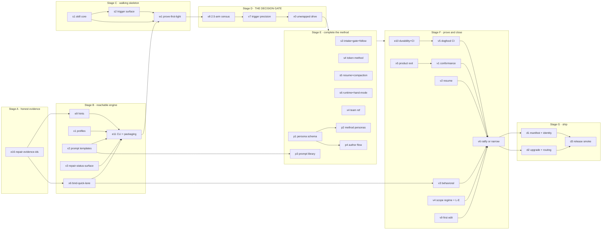

# ADD-SKILL — proposal v5

**The goal, as an end-state of the world (unchanged since v1):** a repo owner drives any
project — a 30-minute fix or a 6-month product — through one skill plus one CLI; resumes it
cold from the bundle alone; trusts every shipped change through a recorded receipt; can see
what the AI did without reading the diff; and pays a token cost proportional to the risk of
the request.

v4 closed the gap between *a design that is right on paper* and *a thing that installs.*
v5 closes the gap between *a substrate that passes its own tests* and *a product that keeps
the promises its documents make.* It is the first version written with two milestones of
execution behind it, and the first to audit the benchmark it argues from.

---

## 0 · Review verdict — what this pass measured, and what it changed

### 0a · Live state, OBSERVED this session

| check | result |
|---|---|
| `python3 -m pytest tests/ -q` | **212 passed** in 7.8s |
| `python3 scripts/validate_bundle.py .add` | **62 nodes · 171 edges · 0 info · 0 error · CONFORMS** |
| `wc -l add/scripts/add.py` | **1,865** — the governing figure is now **1,114 / 1,550 code** (D-15) |
| M0 `format-standard` | **done** — 10/10 gated, closed with a census |
| M1 `engine-core` | **active** — 12 of 16 done; all ten verbs gated |
| M1 remaining | `e9 hints` · `e10 durability` · `e11 package-in-skill` · `e16 repair-evidence-ids` |
| M2 · M3 · M4 · M5 | **not started** |
| contents of the shipped `add/` directory | **one file: `scripts/add.py`** |
| CLI entry point | **none** — no `argparse`, no `sys.argv`, no `__main__` |
| `~/.claude/skills/add/` | still the live AIDD 2.5 install (R2's collision, re-confirmed) |

### 0b · Carried forward unchanged

The goal · the three beats · the five specs · the authority ladder · the depth dial · the
10-verb surface · one-artifact packaging · laws L1–L7 · amendments A1–A24 (landed in
`FORMAT.md` v1.3-draft) · findings R1–R11 and P1–P8 and their dispositions · decisions
D-1 … D-10. None of it is re-litigated here. What v5 changes, it names.

### 0c · Findings from this pass

Twenty findings, in four families. Each was established by **running something or reading a
source**, never by preference. Each acquires an owner.

**Family N — the product does not keep the promises the documents make.** All eight came from
executing the engine rather than reading it.

| # | finding | evidence | lands as |
|---|---|---|---|
| ~~N1~~ | ~~`init` scaffolds 7 files~~ **RETRACTED** — I read `init`'s return tuple at the wrong index; `out[0]` is the node dict, which correctly excludes `log.md` because a journal is not a node. `init` creates 8 files, exactly as FORMAT §5 states | re-probe | — (kept visible; a retraction that leaves no trace is how a ledger stops being evidence) |
| **N2** | **The `doc` profile drops a spec lens.** `init(profile='doc')` creates **7 files, no `specs/system.md`**. The engine comment at `add.py:479` says *"a profile selects which SPEC LENSES a bundle gets"* — against FORMAT §5 (*"the lens set never changes; the skeleton does"*) and `specs/domain.md`'s binding decision (*"the five lenses are closed"*). G6's falsifier watched for a **sixth** lens; the engine removed a **fifth** | `add.init()` probe, 4 profiles | **x1**; and **A25** |
| **N3** | **Four of six promised profiles do not exist, and the miss is silent.** `PROFILES` holds `code` and `doc`; `code` is not among the six §4b names. `init(profile='api-service')` **succeeds**, falls back at `add.py:519` (`PROFILES.get(p) or PROFILES["code"]`), and writes `profile: api-service` into `index.md` anyway. This repo's own `PROJECT.md` says `profile: cli-tool` — a profile the engine does not implement | same probe | **x1** |
| **N4** | **The XML prompt library is orphaned — `brief` never loads a template.** No template loading exists anywhere in `add.py`. The three M0-gated skeletons at `templates/prompts/*.xml.tmpl` are read by no code; `brief` hard-codes its XML. FORMAT §7 states the opposite contract | `grep "tmpl\|templates\|prompts/" add.py` → nothing | **x2** |
| **N5** | **The prompt library contains a dead command.** `build.xml.tmpl:25` cites `add locate`; D-2 folded it into `status --locate`. R:FAKEHINT, inside the prompt that teaches the build beat | file read | **x2** |
| **N6** | **`persona_corpus:` is a dangling path.** `.add/index.md:14` → `../AIDD-Book/personas-teacher`, which **does not exist**; the real dirs are `add-method/personas-teacher` and `.add/personas-teacher`. Nothing validates the key, and D-4's whole author flow resolves through it | `ls` | **x1** + a `doctor` check |
| **N7** | **`status` — the resume verb — does not deliver §4b's surface.** Observed: no beat, no git progress, no cheapest lane, no fold nudge, no stuck rule, no lane advisory (E8), no aging (E11). Five Spec lines and `index` (with an empty `type:`) burn the ≤20-line orientation budget. **Worst: it emits `next: add brief build-durability` while the milestone CARD says `next: e16` — the engine's affordance and the authored one disagree, and e16 is the one that must land first** | `add.status()` on this bundle | **x3** |
| **N8** | **The quick lane gates PASS on a receipt that binds nothing.** One call on a fresh bundle → `gate PASS`. The node has **no `scope:`** (gate printed *"freshness: n/a"*), **no CHECKS** (so `bind()` binds the empty set and passes vacuously), a `command-exit`/`ids: unknown` receipt, an `## EVIDENCE` section still holding raw template tokens, and a CARD reading `next: add run … -- <cmd>` on a **done** node. FORMAT §6 and §3d both promise *"auto on a green, **covers-bound** receipt"* | `add.quick()` probe, node + receipt read | **x6**; and **A26** |

**Family B — the evidence base.** The most consequential family, because §3 argues from it.

| # | finding | evidence | lands as |
|---|---|---|---|
| **B1** | **The 251-engine-call baseline is a documented 14× counting bug, and v4's headline is built on it.** `score.py:683`'s own docstring: *"This was a `re.findall` over the ENTIRE transcript text … It counted MENTIONS: SKILL.md's command cookbook echoed into context, every `next:` footer the engine printed, every command the agent restated in prose. On `runs-pay-gateA-2026-07-27/add/pay1` it scored **99 against 7 real invocations — a 14× inflation, under a number that every per-task cost claim keyed off.**"* `BENCHMARK.md` was last modified **2026-07-18**; the fix is later. **The published `census 251/74/27` was never recomputed.** v4 §3d: *"2.5's WM1 census was 251 engine calls. The milestone budget is a ≥8× cut."* Corrected, the baseline is ~18 and **a ≤30-call milestone budget is an increase, not a cut** | `score.py:683-699` + `git log -- BENCHMARK.md` | **§3d rewritten; the "≥8× cut" claim RETRACTED**; `v8` |
| **B2** | **The "8× run-to-run variance" is a harness change, not variance.** Reported by the review as explained away in the source itself; true same-config spread is ≈1.13–1.41×. This matters in both directions: it weakens the excuse for n=1 *and* strengthens the case that a well-controlled n=3 is affordable | benchmark review | §7's rep counts re-derived |
| **B3** | **Weakness 4 is mis-targeted.** The benchmark shows 2.5 **already won** the short-scope regime (≈0.4–0.5×). The real loss is **greenfield cost and time-to-first-edit** (`BENCHMARK.md:94`: add 242/242/348 s vs spec-kit 44/68/103 s — a **4–5× slower first edit**), and `v4 eval-scope-regime` excludes greenfield by construction ("against the same *established* codebase") | `BENCHMARK.md:88-96` | **G9**, `v4` re-scoped, `v9` |
| **B4** | **No eval in the plan compares ADD 3.0 to ADD 2.5.** `v1` is absolute; `v4`'s comparison arm is spec-kit. The project's entire stated purpose is *"fix 2.5's weaknesses"*, and nothing measures 2.5 | §7 audit | **`v8` — the 2.5-arm census, hoisted to gate-0** |

**Family S — the skill layer.** Measured against the live 2.5 install, the only empirical
evidence of what a working version of this method looks like.

| # | finding | evidence | lands as |
|---|---|---|---|
| **S1** | **The skill has no budget, and the engine has four amendments' worth.** The live install measures **148 lines of `SKILL.md` + 1,883 across 18 references = 2,031**; the source head is **178 + 1,829 across 10 refs**, plus a 690-line `persona-author/` sub-skill. v4 budgets the front door at ≤200 and leaves the references unbounded: it budgets **~8% of the artifact**. The engine's 2,400-line ceiling has a per-task allocation, a CI assertion, a pre-booked cut order and four amendments defending it. *(v4's "178" is correct for the source head; the live install is the older v2.3.0 at 148 — an earlier draft of this section had that backwards)* | `wc -l` on both trees | **G10** + **D-11** + a skill budget in §4a |
| **S6** | **No version of this method has ever driven the loop from `SKILL.md` alone — and the budget's evidence is an artifact of that.** `benchmark/arms/add.toml:5` sets `prompt_wrapper = "add-loop"`, and `runner/core.py:87-108` is that wrapper, verbatim: *"run `add.py status` **FIRST** and follow its next-step through the phases; write **NO app code before** the task's contract is **FROZEN** and its red suite exists; **record the verify gate** before finishing … you carry the human's **proxy authority** … take the 3-call walk."* **The wrapper IS the three beats** — it fires the first engine call, forbids code-before-freeze, and mandates the gate: the exact three things `SKILL.md` is supposed to cause. The authors caught one asymmetry (`BATCH_CLAUSE`, retired 2026-07-27) and did not retire this one | `add.toml:5` + `core.py:87-108`, read verbatim | **the strongest possible argument for D-13.** `v0` is not testing a refinement — it is testing something never demonstrated at all |
| **S7** | **The proven first link is a `CLAUDE.md` block, and v4 ships none of it.** 2.5's root is neither the hook nor `next:`: `init` injects a marker-delimited block into **CLAUDE.md / AGENTS.md / .clinerules** (`add_engine/guidelines.py:27-40`, *"agent-agnostic by design … any agent — Claude, Cursor, Copilot, Codex"*), whose first line is *"run `add.py status` — your resume point; read it first each session."* It is what the benchmark wrapper points at (*"see CLAUDE.md"*). v4 replaces it with a **Claude-Code-only `SessionStart` hook** and defers `AGENTS.md` outright (v4 §10). Two consequences: **G7 and §4h become Claude-exclusive**, and the description's primary trigger — *"a repo has `.add/`"* — is **not observable**, because a cold agent does not `ls` before answering | `guidelines.py:27-40`, `:190` | **`s7`**; E12 stays demoted |
| **S8** | **The triggering mechanism is biased against exactly the request class the quick lane exists for.** `skill-creator/SKILL.md:398`, verbatim: *"Claude only consults skills for tasks it can't easily handle on its own — simple, one-step queries … may **not** trigger a skill even if the description matches perfectly."* The quick lane targets 30-minute fixes — precisely the queries that will not fire. **The lane built to fix weakness #4 is the lane least likely to ever load** | skill-creator docs | `s0`'s query set gets a small-change class; **§11 weakness 4** |
| **S9** | **The identity contract does not solve the collision at the trigger level.** D-7 routes on `abf_version:` — but that is mechanical only *after* one skill loads. `add-legacy`'s own description still reads *"Use whenever a repo has `.add/`"* (`~/.claude/skills/add/SKILL.md:7`). Both descriptions sit in the skill list and both match on `.add/`; nothing rewrites the legacy one, and no M2 or M5 task owns it | frontmatter read | **`s13`** |
| **S10** | **Nothing binds the skill's vocabulary to the engine.** L5 makes *version* skew impossible; **vocabulary** skew is untouched. The cookbook's command strings, the `next:` hints `e9` emits, and the flag names in `add.py` are three hand-maintained copies of one set of facts — L7's exact failure mode, applied everywhere except the skill | design audit vs L7 | **`s12`** |
| **S2** | **The 6-reference decomposition folds 2.5's largest file into a shared one.** 2.5 gives each beat a file: `direction.md` **345**, `verify.md` 182, `build.md` 101. v4 folds all three into one `loop.md` *and adds four new contracts to it*. Prediction: `loop.md` cannot carry that under ~250 lines | same | a falsifier on `s1` |
| **S3** | **E12's SessionStart hook fixes a problem 2.5 solved with one sentence.** `~/.claude/skills/add/SKILL.md:33`: *"## Always start here (orient — do not skip) … run `add.py status --brief`."* The root of the affordance chain is the skill's own first imperative, which fires whenever the skill loads. The hook only helps in sessions where the skill did **not** load — where `status` output arrives with no method attached | file read | `v0` gains a control arm; E12 demoted to *earn-it* |
| **S4** | **v4's trigger plan drops the positive surface that works today.** 2.5's frontmatter carries explicit trigger phrases (*"or the user says 'add', 'start a task', 'next phase'…"*), a presence condition (*"whenever a repo has `.add/`"*), `keywords:` ×10, `user-invocable`, `argument-hint`. `s2` plans name + description + when-NOT-to-use + regime + routing — it keeps the negative surface and drops the recall surface | frontmatter read | `s2` re-specified |
| **S5** | **The regime statement may suppress the recall it is shipped inside.** Putting *"ADD ran 3–4× the price on large greenfield"* into the **description** — the field whose only job is firing — means the trigger argues against itself at load time. It is the right thing to say; the question is which field | §1 vs §4a | `v7` gains a second arm |

**Family E — the engine as a product.**

| # | finding | evidence | lands as |
|---|---|---|---|
| **E-1** | **There is no CLI.** No `argparse`, no `sys.argv`, no `__main__` anywhere in 1,822 lines. `python3 add/scripts/add.py status` does nothing. "All ten verbs gated" means *ten functions are tested* | `grep` | `e11`, re-budgeted |
| **E-2** | **`e11`'s 80-line allocation cannot hold the CLI.** It owes argparse with 10 subparsers, ~20 flags, `--dry-run` on every write verb, `--json`, exit codes, `--help`, error handling and `next:` printing. Realistic: 150–250 lines. Owed = e9 80 + e10 80 + e16 60 + e11 ~200 = **~420 against 278 slack.** **The A3 invariant breaks.** D-6 says the ceiling never moves — so a verb goes | line count + flag enumeration | **D-12** |
| **E-3** | **Two of three nodes in this bundle were hand-written.** `generated.by`: **22 `claude/opus-5` vs 11 `add/3.0.0`**. Authority stamps: **45 human vs 18 process**. 23 gates, 18 freezes, 18 runs, 27 receipts. M1's EXIT *"`.add/` is driven by the engine, not by hand"* is not close to met, and weakness #5 (UX at gates) measures **worse** here than in 2.5 | `grep` counts over `.add/**` | `e11` M3; **§11's honest verdict** |

### 0d · The one structural finding

Twenty-six of forty-two tasks are done and **all twenty-six are substrate**. The product is 0%
built and 0% measured: `add/` holds one Python file with no entry point. Meanwhile the substrate
generates its own backlog — M1 grew 12→16 by amendment A4, and F5/F6/F7 each spawned an owner.
And v4 schedules the two results that could kill or narrow the project — `v7` trigger precision
and `v0` unwrapped drive — at **positions 27 and 28 of 42**.

> **The plan's cheapest kill-tests are its latest tasks.** Every task between here and them is
> paid for with two unmeasured assumptions: that the skill loads, and that a cold agent can
> drive the loop with it. v4 §8 names adoption as the weakest link and then schedules it last.

Family N is the same defect one altitude down. Ten verbs are gated; eight promises those verbs'
own documents make are unkept. They passed because the checks asserted *the machinery ran*,
never *the promise held* — F5's class (`{slug}` unsubstituted, survived 15 checks and a human
gate), generalised:

> M1 proved the ten verbs exist as **functions**. It did not prove they exist as a **product**,
> and its EXIT criteria cannot tell the difference.

---

## 1 · Goal, non-goals, regime

### The goal, decomposed into what must be true

G1–G8 are carried from v4 unchanged. Two are added, and one is sharpened.

| # | end-state | falsified by |
|---|---|---|
| G1 | One artifact installs the method; the agent runs the engine with nothing else installed | any install step beyond dropping the directory in place |
| G2 | A cold agent, given only the skill, drives direction → build → verify with no wrapper | `v0` adherence below the §7 bar |
| G3 | Every shipped change carries a recorded, fresh, **check-bound** receipt and a named authority | a gate that passes with no receipt, a stale receipt, or a `covers:` key no test satisfied — **including a gate entitled by an empty `covers:` set (N8)** |
| G4 | Resume after two weeks — or after a compaction — costs one command plus one node read | any resume that re-reads the repo |
| G5 | Ceremony is proportional to risk, and the cheap lane is *chosen*, not merely available | `v3` shows the quick lane unused where eligible |
| G6 | The five specs fit a wide range of domains without changing the lens set | a profile that needs a sixth lens — **or one that ships with four (N2)** |
| G7 | The method still works with the engine unavailable, at reduced convenience | any rule that cannot be honoured by hand-editing files |
| G8 | A human can see what the AI did, mid-flight, in one command and under a minute | a human who must read the diff to answer "what happened since I last looked?" |
| **G9** | **Every promise a shipped document makes is a check something runs.** A verb's specification, a lane's guarantee and a profile's name are all promises; each has an assertion or it is not shipped | any document sentence describing user-visible behaviour with no check behind it — Family N is eight of them |
| **G10** | **The method is budgeted like the engine.** `SKILL.md` + references carry a stated ceiling, a per-file allocation and a CI assertion, on the same terms D-6 gives the engine | a reference file with no allocation, or a total nobody counts (S1) |

**G9 is the meta-fix for Family N. G10 is the meta-fix for S1.** Neither adds a feature; both
add a way of being wrong that we can detect.

### Non-goals, stated so they stop costing design effort

- **Not a correctness upgrade.** Six benchmark milestones say a good spec-first alternative
  reaches the same answers.
- **Not cheapest.** 64% of ADD's tokens are the trust block; that block *is* the product.
- **Not universal.** A one-off script is better served by vanilla. The skill says so out loud.
- **Not a migration target for 2.5 bundles** in v1 — but 2.5 bundles must keep working (R2).
- **Not fast to first edit.** B3 measures 2.5 at 242–348 s to first edit against spec-kit's
  44–103 s. ADD front-loads direction by design. v5 states this rather than discovering it in
  a benchmark.

### The regime statement (verbatim in `SKILL.md`; see S5 for where it goes)

> Use ADD when a change needs to be *trusted later*: a shared codebase, a contract other work
> depends on, a project you will return to cold. ADD is **slower to the first edit** — it fixes
> direction before it builds. On small increments against an established codebase it ran at
> **half** the price of a spec-first alternative; on large greenfield milestones, **3–4×**. If
> nobody will ever ask "why is this correct?", ADD is the wrong tool.

Changed from v4: *"slower to the first edit"* is now stated (B3). The word "cut" no longer
appears anywhere near an engine-call number (B1).

---

## 2 · Methodology and the laws

### How this project is run

Rules 1–8 carry from v4. Two are added, both earned this pass.

1. **Distil, don't rewrite.** 2.5's core is proven and kept verbatim in meaning.
2. **Format first.** The engine compiles against the format.
3. **The engine is a notary and a compiler, never a judge.**
4. **Every budget is a tested number.** A budget nobody counts is a wish.
5. **Dogfood from M1.** This repo's `.add/` runs on the engine we ship.
6. **Red/green TDD on every verb.**
7. **Verify the standards you profile.** Every external spec claim carries its section, checked
   against the source.
8. **Ship the smallest surface that carries the law.**
9. **Verify the *evidence* you argue from, not only the standards you profile.** Rule 7 was
   applied to OKF and ATG and never to the benchmark — which is where every cost claim in §3
   comes from. B1 is what that costs: a headline built on a number its own source had already
   documented as a 14× artefact. **A citation to your own prior work is still a citation.**
10. **A promise is a check.** Every sentence in a shipped document that describes user-visible
    behaviour is a claim, and a claim with no assertion behind it rots exactly like an authored
    duplicate (L7) — Family N is L7 applied to *behaviour* instead of to *facts*.

### The laws

L1–L7 carry unchanged from v4. One is added.

| # | law | evidence / consequence |
|---|---|---|
| **L1** | **Files are the database.** | kills 2.5's state-as-truth failure class |
| **L2** | **Every read has a tier.** T2 is single-node | context is the multiplier on every fresh read |
| **L3** | **Notary, not guard.** | OKF §11, verbatim |
| **L4** | **The engine teaches at the moment of use.** | 0% → immediate adoption, measured |
| **L5** | **One artifact, one version.** | two shipping vehicles is a second source of truth |
| **L6** | **The bundle is authored content; everything else is data.** | without it `brief` is an injection path |
| **L7** | **Compiled beats authored.** | R10: three stale facts in one day at 20 nodes |
| **L8** | **A gate is entitled by what a receipt *contains*, never by what it *lacks*.** A binding predicate over an empty set must refuse or degrade visibly — it may never pass quietly | **NEW.** N8: the quick lane's PASS was earned by a node that declared no scope and no checks. Every refusal in `gate` assumes a node that declared something, so the cheapest lane is the least guarded — and it is the lane the short-scope claim rests on |

---

## 3 · Strategy — the cost model

### 3a · The model

**Cost = turns × context-per-turn.** Confirmed by the activity decomposition: identical activity
proportions between arms, 2.3× the turns, 1.4× the context per turn.

> Within a single conversation, turn *N*'s context is mostly turn *N−1*'s plus a tool result —
> repeated prefix, not new payload. The size lever bites hardest where context is **fresh**: a
> subagent's first turn, a cold resume, a new session, a compiled brief. Turn *count* is the
> lever that always bites.
> [DERIVED; magnitude ASSUMED until `v1`.]

### 3b · The corrected evidence base (B1, B2, B3)

This is new in v5 and it is the section that changes most.

| claim v4 argued from | status | corrected |
|---|---|---|
| 612 vs 268 turns · 188k vs 135k context/turn | **CONFIRMED** | — |
| specify+scenarios+contract = 3%; tests 34% + verify 30% = 64% | **CONFIRMED** | — |
| ≈0.5× on small increments; 3–4× on large milestones | **CONFIRMED** | — |
| 0.97 fidelity floor, no catastrophic milestone | **CONFIRMED** | — |
| the wrapper was tuned 3× while the comparison arm got none | **CONFIRMED** | — |
| **"2.5's WM1 census was 251 engine calls; ≤30 is a ≥8× cut"** | **CONTRADICTED** | the counter inflated 14× by counting mentions; corrected baseline **≈18**. **A ≤30-call budget is an increase.** The "≥8× cut" claim is **withdrawn** |
| **"8× run-to-run token variance"** | **CONTRADICTED** | a harness change the source explains; same-config spread ≈**1.13–1.41×** |
| **weakness 4 = "low benchmark result on short scope"** | **MIS-TARGETED** | 2.5 **won** short scope (≈0.4–0.5×). The real loss is greenfield cost and **time-to-first-edit, 4–5× slower** |

**What B1 costs us, stated plainly.** §3d's headline was the single most quotable number in v4,
and it was wrong in the direction that flattered us. The mechanism is exactly methodology rule 7,
unapplied to our own prior work. The honest replacement is not a smaller multiplier — it is a
different claim:

> ADD 3.0's ceremony target is **≤30 engine calls on a deep 8-task milestone with a CLI that did
> not exist in 2.5**. Against 2.5's corrected ≈18, that is **not a reduction**, and the defensible
> claim is *comparable ceremony at higher evidence density* — every call now produces a bound
> receipt rather than a state mutation. Whether that trade is worth anything is `v8`'s question,
> and `v8` did not exist until v5.

**And B2 cuts the other way, in our favour.** If same-config spread is ~1.3× rather than 8×, then
n≥3 is genuinely affordable and the "cost is directional only" hedge in v4 §7 was over-bought.
§7 tightens accordingly.

### 3c · The levers, ranked by the evidence behind them

| lever | attacks | mechanism | owner |
|---|---|---|---|
| **L-A · fewer turns** | 612 → ≤400 | compound `done`; whole-bundle composition in ONE draft; one suite run per beat; `status` answers "what now" in one call | e4, e6, s1 |
| **L-D · adoption** | *whether any lever ever fires* | `next:` on every verb; the allowlist; **the orient sentence (S3)**; the skill actually triggering | e9, s1, s6, d1, v7 |
| **L-E · context isolation** | the 188k/turn number at its source | `brief --for-subagent` IS a subagent contract: N briefs → N worktree-isolated subagents → N receipts → one milestone gate | e5, s6, **x4**, v4 |
| **L-B · smaller fresh context** | briefs, resumes, cold starts | T0/T1/T2; refs not prose; a declared byte budget; done-nodes excluded | e5, e6, e10 |
| **L-C · risk-proportional ceremony** | the 64% trust block, on cheap work only | depth dial; quick lane; `sensitivity:` escalation; the downward lane advisory | e4, s3, e9 |

**Not a lever:** writing fewer specs. Specify + scenarios + contract is **3%** of tokens. Ban
permanent.

**One measured data point on L-E, from this project.** The single worktree-subagent trial (e15,
`log.md` 2026-07-30) cost **123,069 tokens, 53 tool calls, 12.5 minutes** from an 11,458-byte
compiled brief, and every constraint held. That is one rep and it is the only L-E evidence that
exists; §7 turns it into a measurement rather than an anecdote.

### 3d · Ceremony budgets by lane — restated against the corrected baseline

Budgets are **targets asserted mechanically in `v1`**. Every `brief` prints its budget and actual.

| lane | engine calls | brief budget | turns (target) | human approvals | example |
|---|---:|---:|---:|---:|---|
| **quick** | **1** (`add done`) | ≤ 2k tok | 3–6 | 0 — **and only when `covers:` is non-empty and bound (L8)** | rename a flag; add a log line |
| **standard** | ≤ 3 + 1 `run` | ≤ 6k tok | 12–20 | 0–1 | add an endpoint field with validation |
| **deep** (per task) | ≤ 3 + 1 `run` | ≤ 10k tok | 20–35 | 1 (human freeze) | change an auth contract |
| **deep milestone** (8 tasks) | ≤ 30 total | — | ≤ 160 | 1 ratify + 1 close | ship an auth layer |

**Calibration, corrected (B1).** 2.5's WM1 census, recomputed by the fixed counter, is ≈**18**,
not 251. The ≤30 milestone budget is therefore **not a cut** and is no longer described as one.
What it is: a *counted* budget over a *CLI surface 2.5 did not have*, where each call leaves a
bound receipt. `v8` decides whether that is worth its price.

What each lane refuses to pay for:

- **quick** refuses RULES/PLAN/LESSONS, a freeze round-trip, a persona body read — **and now
  refuses to auto-PASS on an empty `covers:` set (A26).**
- **standard** refuses milestone strategy, human round-trips, re-grounding.
- **deep** refuses nothing — it is the lane that earns the trust block.

### 3e · The token method by project kind (user goal 4)

Unchanged in shape from v4, and now blocked on **x1**: four of these six profiles do not exist
(N3), so this table currently teaches from two.

| profile | where the tokens go | the lever that pays most | lane mix | worked example |
|---|---|---|---|---|
| `api-service` | contract detail + integration tests | GROUND once per milestone (A8) | 20 / 60 / 20 | "add a field with validation" (standard, 6k brief) |
| `ui-app` | visual/interaction verification, which resists a receipt | the depth dial — most UI work is `quick` | 55 / 35 / 10 | "add an empty state" (quick) |
| `library` | public API surface + backward compatibility | frozen `gives:` — freeze carefully, once | 15 / 50 / 35 | "add an optional parameter" (deep) |
| `cli-tool` | verb surface + output contract | one-draft composition | 30 / 55 / 15 | "add a flag to an existing verb" (standard) |
| `data-pipeline` | schema correctness + backfill risk | the sensitivity floor — batch through ratification | 10 / 45 / 45 | "add a derived column" (standard, `sensitivity: data`) |
| `doc` | almost nothing; the content *is* the deliverable | the quick lane by default | 80 / 20 / 0 | "correct a stale section" (quick) |

The pedagogy is the point: not "use fewer tokens" but **which lever is load-bearing in your kind
of project, and what a right-sized request looks like there.**

---

## 4 · Feature tables

### 4a · The SKILL (judgment layer) — now with a budget (G10, D-11)

| | v4 | **v5** |
|---|---|---|
| `SKILL.md` | ≤200 lines | ≤200 lines |
| references | 6, **unbounded** | **11 + assets, ≤1,100 lines total**, per-file allocation below |
| total artifact | unstated | **≤1,500 lines** (200 + 1,100 + ≤200 assets), asserted in CI by `s12` |

For calibration: 2.5 ships **2,031** lines across 19 files (source head: 2,007 across 11 plus a
690-line `persona-author/` sub-skill). ≤1,500 is a **26% cut on a proven artifact** — and unlike
v4's number it is measured against the whole thing rather than the front door. ⚠ S6: 2.5's
artifact has never been shown to work *without a wrapper restating the loop*, so "proven" here
means proven-with-a-wrapper. That is precisely what `v0` measures.

| feature | what it does | freedom | ref | lines |
|---|---|---|---|---:|
| Trigger surface | `name` + description + **explicit trigger phrases + the `.add/` presence condition (S4)** + when NOT to use + regime + 2.5 routing | low | — | in `SKILL.md` |
| **Orient-first rule** | the skill's first imperative is `add status` — **the root of the affordance chain (S3)**, before any hook | low | — | in `SKILL.md` |
| Intake sizing | classify → `quick`/`task`/`milestone`/`change-request` *before* scope; sets `depth` and `sensitivity` | medium | `intake` | 120 |
| 3-beat loop | DIRECTION → BUILD → VERIFY | high | `loop` | **250** ⚠ S2 |
| Quick lane | one-call `add done`; auto-escalate on security/data/architecture; **refuses an empty `covers:`** | low | `intake` | — |
| Authority ladder | human · plan · ai-verify · process; sensitivity pins the floor | low | `loop` | — |
| Human-gate contract | goal · `gives` · checks · the ONE riskiest assumption and its cost · the cheapest legal alternative. **≤15 lines, decidable in 30 s** | low | `loop` | — |
| Follow-along contract (G8) | what `status --since` shows and when to offer it | low | `loop` | — |
| Reasoning arc | fable-thinking distilled: the Floor at intake, claim tags, the refute pass at the gate | high | `loop` | ~40 |
| Token method | turns × context; tiers; §3d budgets; **§3e per-profile method** | medium | `token` | 150 |
| Resume | cold start = `add status` + one T2 read + git progress; **post-compaction re-orientation** | low | `resume-learn` | 110 |
| Learning loop | `add learn <lens>` deltas → fold at close | medium | `resume-learn` | — |
| Persona select→fold→author | reuse · fold · author; the generic 15-year fallback never lowers a gate | medium | `personas` | 130 |
| Runtime & parallelism | invocation path; allowlist; **hand-mode** | low | `runtime` | 120 |
| **AI team (NEW — user goal 8)** | **when to fan out, how many agents, which verification shape per depth, the worked wave** | medium | **`team`** | **120** |

### 4b · The ENGINE (`add`) — 10 verbs

| verb | does | tier | flags |
|---|---|---|---|
| `init` | scaffold the 8-file bundle; seed the 5 specs from a domain profile | write | `--profile <api-service\|ui-app\|library\|cli-tool\|data-pipeline\|doc>` |
| `new <slug>` | create a node from the one template; sections set by `depth` | write | `--milestone` · `--todo` · `--depth` · `--dry-run` |
| `freeze <slug>` | stamp the freeze; freeze `gives:`; refuse when a Must/Reject is in no check; pin the floor on a `sensitive_paths:` match | write | `--by` · `--authority` |
| `run -- <cmd>` | execute **the caller's** command; capture a receipt with extracted IDs and outcomes | write | `--scope` · `--junitxml` |
| `gate <slug> <verdict>` | record PASS / RISK-ACCEPTED / HARD-STOP; refuse without a fresh receipt; refuse an unmet `covers:`; **refuse an empty `covers:` at auto-authority (A26)**; stamp the brief hash | write | `--by` · `--authority` |
| `done <slug>` | quick lane: new + freeze + gate in ONE call | write | `--cmd` |
| `status` | **the resume verb**: active nodes, beat, git progress, next command, cheapest lane, fold nudge, stuck rule, lane advisory, aging | T0 | `--brief` · `--json` · `--graph` · `--find` · `--all` · `--since` |
| `brief <slug>` | compile the XML pack **from `templates/prompts/*.xml.tmpl` (x2)**; enforce the byte budget; emit a subagent contract; deterministic, prints its hash | read | `--phase` · `--for-subagent` |
| `learn <lens> "<lesson>"` | prepend a delta to one of the five specs | write | `--fold` |
| `doctor` | conformance scan + graph rebuild + orphans + skew + compile `index.md`/`log.md` + `spec_stale` **+ `corpus_unresolved` (N6)** | mixed | `--fix` · `--sync` · `--locate` · `--close` · `--census` |

**Plus the thing that does not exist: the CLI (E-1).** Ten verbs reachable as `python3
<skill>/scripts/add.py <verb>`, `--dry-run` on every write verb, `--json`, `--help`, exit codes.
Re-budgeted from 80 to **200 lines** (E-2) — which breaks the A3 invariant and forces **D-12**.

**Budget:** ≤ **1,550 CODE lines**, stdlib only, single file (**D-15**). This paragraph previously
read *"D-6 stands: the ceiling has never moved and does not move now. A verb goes instead."* Both
halves happened: three verbs' flags went (D-12, `e18`, −56 lines) **and** the ceiling moved anyway,
because the cut bought 56 against a 146-line gap. The measured CLI is 208 wc -l / 138 code.

### 4c · Packaging and the identity contract

```
add/
  SKILL.md                    # ≤200 lines
  references/                 # 7 files, ≤1,000 lines total, on demand
    intake · loop · token · resume-learn · personas · runtime · team
  scripts/
    add.py                    # ≤1,550 CODE lines (D-15), stdlib only, WITH a CLI entry point
    templates/                # task · milestone · spec · project · prompts/*.xml
    profiles/                 # 6 domain profiles — as data, not engine branches
    personas/                 # the 3 method personas
  FORMAT.md
  plugin.json
```

The identity contract (D-7) is unchanged and **re-confirmed live**: `~/.claude/skills/add/`
still holds AIDD 2.5. Keep the name `add`; move 2.5 aside to `add-legacy/`; route mechanically
on `abf_version:`; no migration verb in v1.

### 4d · Artifacts — how each is generated, and how dynamic it is

| artifact | generated by | when | lifetime | dynamism | who may edit |
|---|---|---|---|---|---|
| `index.md` | `init`; body TOC compiled by `doctor` | once + on change | bundle | frontmatter static, **body compiled** | engine |
| `log.md` | **compiled** from `verified[]` + `generated.at`, ISO date groups; `## Notes` human-owned | on `--sync` and every write verb | rotates at milestone close | **compiled** | engine (+ human in Notes) |
| `PROJECT.md` | `init --profile` | once | bundle | living; **Voice** human-owned | human; AI on the rest |
| 5 specs | `init` from the profile; `learn` prepends; folds at close | continuous | bundle | **self-compacting** | AI + human |
| task / milestone nodes | `new` from ONE template; sections by `depth` | per request | until done | **dynamic shape** (3 or 6 sections) | AI; human may hand-author |
| `graph.json` | `doctor --sync`, incrementally by write verbs | continuous | derived, gitignored | **never authoritative** | engine |
| **XML brief packs** | `brief`, refs resolved against the **current** bundle at call time, **from template files (x2)** | per beat | **never stored** | **fully dynamic** — the fix for hard spec injection | engine |
| **subagent contracts** | `brief --for-subagent` | per parallel task | never stored | fully dynamic, hash-stamped at the gate | engine |
| Run receipts | `run`, consumed by `gate` | per gate | append-only in `<task>.d/runs/` | attested, immutable | engine |
| spec deltas → folds | `learn`, folded at close | per lesson | absorbed into `Now` | self-compacting | AI |
| milestone census | `doctor --census` | at close | permanent in `CLOSE` | compiled | engine |
| review packet | `doctor --close <milestone>` | at close | rendered then folded | compiled | engine |
| `status --since` digest | `status --since` | on demand | ephemeral | compiled | engine |
| personas | the persona-author flow; engine validates schema | on demand | project lifetime | **authored per project** | AI + human |
| **domain profiles** | **authored once as package data — 6 of them (x1)** | per profile kind | ships with the artifact | static asset | maintainer |
| **prompt templates** | **authored as package data; loaded by `brief` (x2)** | per beat kind | ships with the artifact | static asset, **dynamically filled** | maintainer |

**The dynamism that matters:** a brief is composed of *references*, never copied prose. Edit a
spec's `Decisions that bind` and every future brief re-scopes with zero prompt edits. That is
the direct answer to *"hard specs injection prompt → difficult to change scope."* It is the one
weakness §11 rates genuinely closed, and it is closed because the mechanism was exercised.

**The trust boundary (L6):** bundle nodes compose as instructions; repo source, command output
and fetched documents appear only inside `<evidence>`, quoted and labelled.

**The rot boundary (L7):** ten of sixteen artifacts are compiled. The authored ones are exactly
those where a human's judgment is the content.

### 4e · Personas — dynamic, three layers

| layer | ships | authored per project | injection |
|---|---|---|---|
| **method personas** | `task-planner` · `milestone-planner` · `release-planner` — they reason about ADD's own artifacts only | — | frontmatter (T0) by default |
| **domain personas** | **none shipped.** A preset nobody consumes is noise — 2.5 retired 12 | `select → fold → author`, schema-validated: `name · vibe · flow · use-when · not-when` + Identity / Critical Rules / Default Requirement / Success Metrics | frontmatter; **body only when the decision needs the lens** |
| **generic fallback** | a 15-year specialist in the task's `kind:` | — | inline, ~3 lines; never lowers a gate |

**The selection algorithm:** `use-when` match on `kind` + `sensitivity` → candidates. One → select.
Two or more → **fold** into one sharper lens, recorded as a delta on `specs/method`. Zero and the
decision is load-bearing → **author** one, schema-validated, saved to `personas/`. Zero and routine
→ generic fallback, no file written.

**Corpus (D-4):** referenced by path, never vendored — and **`doctor` now checks the path resolves
(N6)**, because a dangling corpus degrades silently to the fallback, which always "works."

### 4f · The AI team — dynamic workflow (user goal 8) — NEW

v4 had the *mechanism* (L-E: `brief --for-subagent` + worktrees) and no *method*. This is the
missing reference, owned by **x4**.

| depth | team shape | verification shape | why |
|---|---|---|---|
| `quick` | none — one agent, one call | the receipt | fan-out costs more than the task |
| `standard` | none by default; one reviewer subagent if `sensitivity ≥ data` | receipt + one adversarial read | the brief is cheaper than the coordination |
| `deep`, ≤3 tasks | sequential in one context | receipt per task, one milestone gate | context reuse beats isolation below the rot threshold |
| `deep`, ≥4 independent tasks | **N briefs → N worktree-isolated subagents → N receipts → one milestone gate** | per-task receipt + a completeness critic at close | this is L-E, and A20/A23 are what make it conflict-free |
| a decision with two defensible answers | **judge panel**: k independent attempts, scored, best synthesised | the fold recorded as a delta on `specs/method` | a roster of near-duplicates is worse than one sharp lens (the persona rule, one altitude up) |

**The rules that bind a wave**, all already in the format:
- membership is frozen at ratification (A1) — a wave cannot grow after approval;
- every subagent gets a **compiled** brief, never hand-written prose (L6, R:HANDBRIEF);
- every subagent returns a **receipt**, not a summary (G3);
- the orchestrator holds **T0/T1 only** — its context grows with milestone count, not task count.

**The one measured data point:** e15, one task, one worktree — 123,069 tokens, 53 tool calls,
12.5 min, every constraint held. `v4` turns this into n≥3.

### 4g · Failure, concurrency, durability

Carried from v4 unchanged, plus three rows.

| failure mode | design response |
|---|---|
| Two agents write the same node | atomic single-file replace (tmp + rename) |
| Two agents write the *same shared file* | **there is no shared mutable file** — `graph.json`, `index.md`'s body and `log.md` are compiled |
| A gate trusts a stale cache | gates re-read frontmatter |
| Tests passed before the last edit | content-addressed receipt freshness (A22), proven against a worktree checkout |
| A gate passes on a check nobody wrote | `covers:` bound to observed IDs; unparseable output degrades to a visible finding |
| **A gate passes because nothing was claimed** | **A26 (L8): an auto-authority gate refuses an empty `covers:` set and names the cheapest way to earn one** |
| Engine and bundle disagree on version | receipts pin the engine version; `doctor` warns on skew |
| Something must be undone | git is the transaction log; no `undo` verb |
| Build interrupted mid-session | `status` reports git progress ∩ `scope:` |
| Context compacted mid-milestone | the skill's first rule after any context loss is `add status` |
| Engine unavailable | **hand-mode**: every rule honourable by editing files |
| Bundle grows to hundreds of nodes | default scans exclude `done\|dropped`; ≤20 node lines; per-milestone graph |
| The human changes a milestone's scope | A21: `amended:` stamp, `status: dropped` with a reason, EXIT append-only, dependents flagged stale |
| A brief composes hostile content | non-bundle content only inside quoted `<evidence>` |
| The skill never fires | `v7` measures trigger precision **before** anything downstream |
| **A shipped document promises behaviour nothing checks** | **G9 + `x5`: every EXIT criterion names a user-visible promise, and `v1` asserts it** |
| **A profile is named but not implemented** | **x1: `init` refuses an unknown profile instead of silently downgrading (N3)** |

### 4h · Harness interop

Unchanged from v4: skill invocation by description plus `/add`; an allowlist for the engine's own
invocation only; `brief --for-subagent` for parallel waves; plan mode maps to `milestone` intake;
the bundle is the durable list and the harness's ephemeral list is never read back; the engine
never commits; the bundle survives compaction by construction.

---

## 5 · Format amendments

**A1–A24 are landed** in `FORMAT.md` v1.3-draft and are not restated. **New in v5:**

| # | amendment | why | owner |
|---|---|---|---|
| **A25** | **A profile varies the *skeleton*, never the *lens set*.** All five spec files are created for every profile; a profile supplies domain-fitted `Now` skeleton text and nothing else. An unknown profile name is **refused**, never silently downgraded | N2 + N3. The engine's `doc` profile ships four lenses against a law that says the set is closed, and four named profiles resolve to a fifth's content while the bundle records the name you asked for | `x1` |
| **A26** | **An empty binding cannot entitle a gate (L8).** At `process`/auto authority, `gate` refuses when the node's `covers:` set is empty, and names the cheapest way to earn one. At `human` authority it warns and records `covers_absent` on the stamp | N8. The quick lane — the mechanism the short-scope claim rests on — currently PASSes on a node that declared nothing, because every existing refusal assumes a node that declared something | `x6` |
| **A27** | **`brief` compiles from template files, and a template is a node.** `prompts/*.xml.tmpl` are `type: Prompt` bundle nodes resolved through the normal fragment grammar; `brief` loads them rather than embedding XML in code | N4 + N5. FORMAT §7 already states this contract and no code implements it; M3's `p3` is scheduled to write a library the engine cannot consume | `x2` |
| **A28** | **Every EXIT criterion names a user-visible promise.** A criterion phrased as "function X exists and is tested" is not a criterion; it must be phrased as what a user can now do, and carry the check that observes it | G9 / Family N. Ten verbs gated, eight promises unkept, because EXIT could not tell the difference | `x5` |

---

## 6 · Plan — milestones, tasks, DAG

### 6a · The revision, in one line

**Pull the two kill-tests forward against a walking skeleton of the skill, before M3 and before
the M1 tail's polish work.**

v4's order is *finish the substrate → build the product → measure it*. That is right if the
substrate is the risk. It is not: the substrate is 212 green checks and a CONFORMS validator. The
risk is **adoption**, which v4 §8 itself names as the weakest link — and we can test it for the
price of two files and two evals instead of sixteen tasks.

This is **not** "skip the engine." Four things must still precede the kill-test:

| must precede | why |
|---|---|
| `e16` repair-evidence-ids | F7: a failing check can be recorded as PASSED. Every number after it is untrustworthy, **including the eval's own receipts** |
| `e9` build-hints-layer | `next:` **is** the adoption mechanism (L4), and F5 means every hint is currently unrunnable |
| `e11` package-in-skill | **there is no CLI (E-1).** An agent cannot invoke a function library |
| `s1` + `s2` | the skill text and the trigger description are what `v0` and `v7` actually test |

And three may wait: `e10` (CI hygiene on an engine of unproven value), `s3`–`s6` (references
elaborating a loop whose core is `s1`), and all of M3 (personas and prompts are the method's
*depth*; `v0` tests whether it has a floor).

### 6b · Milestones, each with its goal

| id | slug | goal (end-state) |
|---|---|---|
| **M0** | `format-standard` | **done** — ABF-1 + A1–A24 ratified, every external standard claim checked against its source, a worked example that validates by existing |
| **M1** | `engine-core` | ten verbs green under red/green TDD, ≤1,550 code lines (D-15), **reachable from a CLI**, shipped inside the skill directory, and this repo's `.add/` driven by it |
| **M1.5** | **`first-light`** | **NEW.** A cold agent, given the skill directory alone, runs `init → quick lane → one standard task → gate` end to end. The walking skeleton, and the input to the decision gate |
| **M2** | `skill-surface` | the full judgment layer inside its ≤1,200-line budget: intake, loop, token, resume, runtime, personas, **team** |
| **M3** | `personas-prompts` | three method personas + the XML prompt library **loaded by `brief`** + the persona-author flow, schema-validated |
| **M4** | `prove-it` | the skill fires; a cold agent drives it unwrapped; **ADD 3.0 is measured against ADD 2.5**; budgets, resume, approvals and lane choice asserted mechanically |
| **M5** | `ship-it` | installable as a plugin with the allowlist and the identity contract, an upgrade path proven, the regime statement published |

### 6c · The task list — 47 tasks (42 carried, 6 added, 1 retired)

**M0 · format-standard (10) — done.** `f1`–`f10`, all gated, closed with a census.

**M1 · engine-core (16, 12 done).** Remaining, in order:

| id | slug | goal | budget |
|---|---|---|---:|
| **e16** | `repair-evidence-ids` | `classname::name` IDs in `extract_ids` **and** `checks_of`; a recorded migration decision for existing receipts; no gated node's citations rewritten | 60 |
| **e9** | `build-hints-layer` | `next:` on every verb, derived from graph state, **runnable** (closes F5) | 80 |
| **e11** | `package-in-skill` | **the CLI**: ten verbs, ~20 flags, `--dry-run`, `--json`, `--help`, exit codes; the skill directory layout; zero install | **200** (was 80 — E-2) |
| **e10** | `build-durability` | CI asserts the A3 invariant **and the skill's ≤1,200 budget (G10)**; concurrency and crash tests; fresh-checkout smoke; closes F6 | 80 |

**New tasks (6).** Each exists because a user goal or a shipped artifact has **no owner**,
verified against the live tree.

| id | slug | goal | closes | budget |
|---|---|---|---|---:|
| **x1** | `ship-domain-profiles` | six profiles as data; all five lenses always created; an unknown profile **refused**; `doctor` checks `persona_corpus:` resolves | N2 · N3 · N6 · A25 | 60 |
| **x2** | `load-prompt-templates` | `brief` compiles from `templates/prompts/*.xml.tmpl`; templates are `type: Prompt` nodes; the dead `add locate` corrected | N4 · N5 · A27 | 40 |
| **x3** | `repair-status-surface` | `status` delivers §4b's surface — beat, git progress, cheapest lane, fold nudge, stuck rule, lane advisory, aging — and its `next:` agrees with **readiness**, not alphabetical order | N7 | 60 |
| **x6** | `bind-quick-lane` | an auto-authority gate refuses an empty `covers:`; the quick-lane node's EVIDENCE is filled; a done node's hint is not "re-run me" | N8 · A26 · L8 | 40 |
| **x5** | `define-product-exit` | every M1/M2 EXIT criterion names a user-visible promise with a check that observes it; `v1` asserts the set | G9 · A28 · Family N | 30 |
| **x4** | `write-team-ref` | `references/team.md`: when to fan out, how many, verification shape per depth, the worked wave, the rules that bind it | **user goal 8** | — (doc) |

**M1.5 · first-light (1).** `w1 prove-first-light` — a cold agent, skill directory only, runs
`init → quick → standard → gate`. Not an eval; a demonstration that produces the artifact `v7`
and `v0` are run against.

**M2 · skill-surface (14).** Budget ≤1,500 lines total (G10, D-11).

| id | slug | goal | closes |
|---|---|---|---|
| **s0** | `write-trigger-eval-set` | 25–40 queries (in-regime · out-of-regime · **small-change (S8)** · resume · 2.5-bundle) + a `.add/` fixture repo, wired to `run_eval.py`. **Runs before `s2`** | S8; and the red-first law, which `s2` currently suspends for the project's highest-risk artifact |
| `s1` | `write-skill-core` | `SKILL.md` ≤200 lines and ≤180 chars/line: 3 beats, lanes, authority, **the reasoning arc inline** (D-of-record, §9) | S2 |
| `s2` | `write-trigger-surface` | name · description **with explicit trigger phrases and the `.add/` presence condition (S4)** · when-NOT · routing | S4 · S5 |
| **s7** | `write-first-contact-block` | the marker-delimited `CLAUDE.md` / `AGENTS.md` / `.clinerules` block `init` injects, and its idempotent-update rule | **S7** — the proven first link, and G7's only agent-agnostic path |
| `s3` | `write-intake-ref` | sizing → depth/sensitivity → lane; the escalation table | — |
| **s10** | `write-gate-ref` | the human-gate contract (≤15 lines / 30 s) + the follow-along contract + the report form — **split out of `loop`** | G8 had no dedicated artifact; 2.5 spent 157 lines on it |
| `s4` | `write-token-ref` | §3d budgets + §3e per-profile method | goal 4 |
| `s5` | `write-resume-learn-ref` | cold + post-compaction resume; delta → fold | — |
| `s6` | `write-runtime-ref` | invocation path · allowlist · subagent fan-out · hand-mode · the L6 boundary | G7 |
| **s8** | `write-terms-ref` | the ABF-1 coined-vocabulary decoder | ~17 coined terms in `FORMAT.md`, none in a model's prior; 2.5 shipped a decoder for fewer |
| **s9** | `write-adopt-ref` | greenfield interview vs brownfield silent map, to the baseline freeze | `e3` scaffolds files; nothing owns the *flow* on an existing repo — the commonest real first contact |
| **s11** | `ship-worked-examples` | filled exemplar nodes at `quick` / `standard` / `deep` in `assets/` | a blank template plus prose yields plausible-shaped, wrong-grained first nodes |
| **s12** | `assert-skill-conformance` | CI: SKILL.md ≤200 lines / ≤180 chars per line · every reference cited from `SKILL.md` with a when-to-read cue · **every cookbook command and every `next:` template resolves to a real verb+flag** | **S10** — L7 applied to the skill |
| **x4** | `write-team-ref` | the AI-team method (§4f) | **user goal 8** |

`personas.md` is budgeted at **150–200 lines, not one table row**: 2.5 needed a 690-line nested
sub-skill to carry select→fold→author, and M3's `p1`/`p2`/`p4` build the schema and the flow but
not the judgment.

**M3 · personas-prompts (4).** `p1` schema + select→fold→author · `p2` three method personas ·
`p3` prompt library **(now consumable, after x2)** · `p4` author flow + corpus resolution.

**M4 · prove-it (10, +2).**

| id | slug | goal |
|---|---|---|
| **v8** | **`census-2-5-arm`** | **NEW, gate-0.** Run 2.5 on the pre-registered task set and count its engine calls, turns, tokens and human approvals with the **fixed** counter. **Nothing in this project has ever measured the thing it claims to improve (B4)** |
| `v7` | `eval-trigger-precision` | does the description fire in-regime and stay silent out-of-regime? Two arms: **with and without the regime statement in the description (S5)** |
| `v0` | `eval-unwrapped-drive` | with no wrapper, does a cold agent invoke the engine, pick a lane, freeze before building, run checks red first, gate on a receipt? Two arms: **with and without the orient sentence (S3)** |
| `v1` | `eval-conformance` | the counted list, in CI, **including x5's promise set** |
| `v2` | `eval-cold-resume` | two-week-cold **and** post-compaction reconstruction |
| `v3` | `eval-behavioral` | lane choice · quick lane when eligible · refusal to weaken a check · security escalation · acting on the advisory |
| `v4` | `eval-scope-regime` | small increment vs large milestone; **and the L-E wave at n≥3** |
| **v9** | **`eval-first-edit`** | **NEW.** Time-to-first-edit against spec-kit. B3 says this is 2.5's real loss (4–5×) and no task owned it |
| `v5` | `build-dogfood-ci` | `doctor` + validator + suite + **both budget assertions** on every commit |
| `v6` | `ratify-1.0` | fold every delta, close the milestones, ratify or **narrow** |

**M5 · ship-it (3).** `d1` plugin manifest + allowlist + identity contract · `d2` upgrade path
and 2.5 routing · `d3` clean-machine release smoke.

**Retired:** `v4`'s standalone parallel-wave smoke folds into `v4` proper.

### 6d · The DAG



**Critical path:** `e16 → e9 → e11 → s1 → s2 → w1 → v8 → v7 → v0` — **nine tasks to the decision
gate**, against v4's twenty-eight.

### 6e · Stage D is a real gate, with pre-committed verdicts

The three outcomes are written **before** the result, so it cannot be re-interpreted afterwards.

| outcome | meaning | what happens |
|---|---|---|
| **PASS** | trigger recall ≥ bar; a cold agent drives the loop unwrapped in ≥2 of 3 reps | Stages E–G run as planned. The full claim stands |
| **NARROW** | trigger fires; adherence fails after ≤3 revisions (D-9's stop rule) | ship *format + engine + a human-driven method*. **Delete `v3`, `v4`, `p2`, `p4`; `s4` shrinks to one profile.** The description says so |
| **STOP** | trigger does not fire after ≤3 description revisions | the skill is not discoverable. No downstream number is worth buying |

### 6f · Is the task list enough? — the sufficiency argument

**Every user goal has an owner:**

| user goal | owned by |
|---|---|
| 1 distil, keep the core, stay simple | §2 · 10 verbs not 15 · `s1` (≤200) · **G10's ≤1,200 total** · one artifact |
| 2 five specs flexible across domains | FORMAT §5 · **`x1` (A25 — the lens set really is closed)** · §3e · `v4` |
| 3 XML prompts, dynamic per task | FORMAT §7 · `e5` · **`x2` (the templates are actually loaded)** · `p3` · A14/A16 |
| 4 a token method with examples per project kind | §3 · §3d · **§3e, unblocked by `x1`** · `s4` · `v1` |
| 5 evidence, and learning for the next loop | A2/A3/A15 · `e7` · `e12` · **`e16` (evidence that cannot be masked)** · `s5` |
| 6 CLI graph state, OKF, resume anytime, ATG | FORMAT §1–3 · `e1`–`e2` · **`e11` (a CLI that exists)** · `x3` · `e8` · `v2` |
| 7 good for short **and** long horizons | the depth dial · **`x6` (a quick lane whose receipt binds)** · `v1` · `v4` · A12 |
| 8 project → milestone → task; **AI team in dynamic workflow** | FORMAT §1–2 · A21 · **§4f + `x4` — the method, not just the mechanism** |
| 9 slugs easy to look up | FORMAT §1 · `status --find` · `--locate` |
| 10 goals on project and milestone | `goal:` required on Project, Milestone and Task |
| 11 durable, maintainable, live | L1 · L7 · **L8** · §4g · A13 · A12 · `doctor` · receipts · git |
| 12 the engine does the common work | §4b · **`e11`** · `e9` makes it discoverable · the allowlist makes it usable |
| 13 the human can follow AI work | G8 · the gate contract · `status --since` · **`x3`** · the close packet |

**Minimality.** Removing any of the six new tasks drops a goal or a law: `x1` → goals 2 and 4;
`x2` → goal 3; `x3` → goals 6 and 13; `x6` → goal 7 and L8; `x4` → goal 8; `x5` → G9.
`v8` and `v9` are the only two evals that measure the thing the project says it is for.

**What would tell us this list is wrong:**

- **`v7` fails** → the skill is not discoverable. Rewrite the description under its own cap; do
  not add tasks.
- **`v0` fails three times** → narrow the product to *format + engine + human-driven method*.
  That deletes tasks; it does not add them.
- **`v8` shows 3.0 is not materially cheaper than 2.5** → the ceremony claim is dead and §11's
  weakness-1/3 rows become OPEN permanently. **The honest response is to re-found the claim on
  evidence density rather than cost, and say so in the description.**
- **`e11`'s CLI passes 250 lines** → D-12 fires and a verb goes.
- **`loop.md` passes 350 lines** → S2 confirmed; split it back into three beat files as 2.5 has.
- **A profile needs a sixth lens** → the closed-lens claim is wrong and M0 reopens.

---

## 7 · Evaluation design

**Conformance is counted. Behaviour is sampled. Cost is compared against the thing we claim to
improve.** That last clause is new and it is B4's fix.

| track | asserts | reps | verdict |
|---|---|---:|---|
| **v8 · 2.5-arm census** (gate-0) | 2.5 on the pre-registered task set, counted with the **fixed** counter: engine calls · turns · tokens · human approvals · fidelity | 1 (deterministic count) | **the baseline every other number is read against** |
| **v7 · trigger precision** | in-regime requests load the skill; out-of-regime do not; a 2.5 bundle routes away. Arms: regime-in-description vs regime-in-body | ≥10 prompts/class | **gates M4** |
| **v0 · unwrapped drive** | with ONLY the skill, the agent invokes the engine, picks a lane, freezes first, runs checks red first, gates on a receipt. Arms: with/without the orient sentence | ≥3 | **gates v3/v4** |
| **v1 · conformance** (CI) | engine calls per lane · `init` = 8 files, 5 lenses, unknown profile refused · brief bytes ≤ budget · a fresh receipt at every gate · an unmet `covers:` refused · **an empty `covers:` refused at auto authority** · identical brief hashes · approval counts · `doctor` = 0 errors · a hand-authored bundle validates · `--since` complete · a parallel wave conflict-free · **every x5 promise asserted** | 1 | pass/fail |
| **v2 · resume** | reconstruct active node + next action from `status` + one T2 read, cold and post-compaction | ≥3 | rubric |
| **v3 · behavioural** | right lane · quick lane when eligible · refuses to weaken a check · escalates security · acts on the advisory | ≥3 | pass-rate |
| **v4 · scope regime + L-E** | small increment vs large milestone; and the parallel wave at n≥3 against the sequential baseline | ≥3 | reported with spread |
| **v9 · time-to-first-edit** | vs spec-kit, on the same task set | ≥3 | reported with spread |

### The stop rule

> `v0` may be re-run after **at most three** skill/hints revisions; `v7` after at most three
> description revisions. If adherence is still below bar, ADD ships with a **narrowed claim** —
> *"a format, an engine, and a method a human drives"* — and the description says so. Narrowing
> is a result, not a failure.

### The eval budget

| rule | value |
|---|---|
| Total M4 budget | **$250** |
| **`v8` allocation** | **~$10** on the archived harness, **run with `prompt_wrapper = "raw"`** (S6: every published 2.5 number used `add-loop`) — it is the cheapest item in M4 and it decides whether the other $240 measures a product or a migration |
| Task set | **pre-registered before the first run**, published in `v8`'s node, shared by `v8`/`v4`/`v9` |
| Overrun behaviour | report the small-scope regime at n≥3 and the large-scope regime as **"directional, n<3"**, labelled in every table. Never silently reduce n |
| Arm fairness | the comparison arm gets the same prompt-tuning allowance ADD gets |
| **Rep counts** | re-derived from B2: same-config spread ≈1.3×, not 8×, so **n=3 is genuinely sufficient** and the "directional only" hedge is not pre-bought |

---

## 8 · Risks

### Weakest links, stated in the delivery

1. **Adoption without an enforcement wrapper — and the wrapper was the loop.** This is no longer
   a worry; it is a read of the harness. `arms/add.toml:5` sets `prompt_wrapper = "add-loop"`,
   and `runner/core.py:87-108` restates the three beats in the prompt: orient first, no code
   before freeze, record the gate, with proxy authority to self-approve. **Every published ADD
   number was produced with the method re-injected at every run.** No version of this method —
   2.5 or 3.0 — has ever been shown to drive the loop from `SKILL.md` alone. v5's answer is to
   measure it **ninth instead of twenty-eighth**, and to run `v8`'s 2.5 arm with
   `prompt_wrapper = "raw"` so the comparison is like for like. [OBSERVED that the wrapper
   carried the loop; ASSUMED what remains without it.]
2. **The ceremony claim may be dead already.** B1 removed its baseline. If `v8` shows 3.0 at or
   above 2.5's corrected ≈18 calls, weakness 1 and 3 are permanently OPEN and the product's
   honest pitch is *evidence density*, not cost. [OBSERVED that the old claim was wrong;
   ASSUMED what replaces it.]
3. **The ≤1,200-line skill budget may be unreachable** if S2 is right that `loop.md` needs 600.
   The fallback is 2.5's own decomposition — a file per beat — and a higher, stated ceiling.
4. **`e11`'s CLI may not fit at all.** E-2 puts it at 150–250 against 278 total slack. D-12
   pre-books the cut so this is a decision, not a crisis.

### What v5 makes worse than v4

| regression | cost | why accepted |
|---|---|---|
| The headline ceremony number is withdrawn | the most quotable claim in the proposal is gone, and nothing replaces it yet | it was wrong. A retracted number costs a paragraph; a shipped one costs the method's credibility on the first project that counts calls |
| Six new tasks and two new evals | the plan is longer | five of the six close a goal that had **no owner**, verified against the live tree; the two evals measure the thing the project is named after |
| M1 grows again (e11 80 → 200) | the engine ceiling is now genuinely tight | the alternative is a CLI that does not exist while the milestone reports ten verbs done |
| A new milestone (M1.5) | one more boundary to close | it is the artifact the decision gate runs against, and it is one task |

---

## 9 · Decisions

### Of record (carried, confirmed)

D-1 skill-bundled engine + optional pipx shim · D-2 10 verbs + flags · D-3 v1.0 = M0–M4 + `d1` ·
D-4 persona corpus by path · ~~D-6 the engine budget rose to 2,400 once and never again~~ **SUPERSEDED by D-15, 2026-08-05 — it rose a second time, and the unit changed with it** · D-7 skill
identity and coexistence · D-8 `log.md` is compiled · D-9 trigger precision is a gate · D-10 M4
carries a budget and a pre-registered task set.

### New in v5 (mine, stated so they can be overruled)

| # | decision | choice | consequence |
|---|---|---|---|
| **D-11** | **The skill gets a budget on the engine's terms** | ≤200 lines and ≤180 chars/line for `SKILL.md` + ≤1,100 across 11 references + ≤200 assets = **≤1,500 total**, per-file allocations in §4a, asserted by CI in `s12` | the product stops being the only unbudgeted thing in a project that budgets everything. 26% under 2.5's 2,031 — and a line cap alone is gameable, so the char/line floor ships with it |
| **D-12** | **`e11`'s CLI is budgeted at 200 lines, and the overflow cut is pre-booked** | if consumed + remaining > 2,400 at any gate, the cut order is `--locate` → `--graph` → `status --since`, then a **verb** (`learn`, folded into `doctor --learn`). Never a law, never the ceiling | D-6 holds. The decision is taken now, with the number in hand, instead of at the moment of overflow |
| **D-13** | **The plan is reordered to reach a decision gate in nine tasks** | Stages A–D before M3 and before `e10`; Stage D's three verdicts pre-committed | the two assumptions every downstream number inherits get tested before we buy more of them |
| **D-14** | **Nothing ships a cost claim until `v8` runs** | the 2.5 arm is gate-0 of M4, ~$10 | B4: the project's entire purpose is "fix 2.5's weaknesses" and no eval compared it to 2.5. A claim measured only against spec-kit is a claim about spec-kit |
| **D-15** | **The engine ceiling is restated in CODE lines and RAISED to 1,550 — D-6 is broken knowingly** | after `e11` was measured (208 wc -l / 138 code) and D-12 fired in full (−56 lines, three UX surfaces withdrawn), the projection was still 2,463/2,400. Two changes, both stated: the unit moves to code lines because `wc -l` makes a comment compete with a feature in a file that is 40% findings; and the ceiling becomes **1,550 code**, which is an ~8% raise over the faithful conversion of 1,440. Projected 1,485/1,550 | D-6 said the budget rose once and never again; it has now risen twice. The defence is not this row but `build-durability`'s CI job, which must land before another allocation is booked — F20 showed the invariant hand-maintained in three places with two of them 120 lines apart |

---

## 10 · Enhancements

**E1–E12 carry from v4.** One is demoted, one is added.

| # | enhancement | status |
|---|---|---|
| **E12** | **Proactive orientation (SessionStart hook)** | **DEMOTED to earn-it.** S3: 2.5 roots the affordance chain with one imperative sentence in `SKILL.md`. `v0`'s control arm tests the sentence; the hook ships only if the sentence alone underperforms |
| **E13** | **`doctor --promises`** — list every EXIT criterion in the bundle whose phrasing describes a function rather than a user-visible promise, and every promise with no check | **NEW.** G9/A28 made mechanical. It is a grep with a rule, so a notary may compute it — and it is the only defence against Family N recurring at M2 |

**Considered and declined** (carried from v4): engine as an MCP server · a `watch` verb or TUI ·
auto-committing from the engine · a 2.5→3.0 migration verb · monorepo bundle rules.

---

## 11 · The 2.5 weakness ledger — honest verdicts

This is the table the project exists for, and v5 is the first version to answer it with counted
evidence from its own dogfood rather than with mechanisms.

| the weakness you named | mechanism | v4 said | **v5 verdict** | why |
|---|---|---|---|---|
| **1 · heavy token/time consumption** | L-A · L-B · L-C · L-E | MITIGATED | **OPEN** | the levers are built but unmeasured against 2.5 (B4). One L-E rep exists (123k tokens). `v8` + `v4` decide it |
| **2 · hard specs-injection; hard to change scope** | refs-not-prose briefs · frozen-`gives` refreeze · A21 milestone amendment | CLOSED | **CLOSED** — the only one | the mechanism is built **and exercised**: `brief` resolves refs at call time, and this project has taken four milestone amendments (A1–A4) without editing a prior one |
| **3 · ceremony tool calls per turn** | 10 verbs · `done` · a ≤30-call milestone budget | "CLOSED by budget" | **OPEN, and its evidence base retracted** | B1: the 251 baseline was a 14× counting artefact; corrected ≈18, so ≤30 is **not a cut**. Our own dogfood: **23 gates, 18 freezes, 18 runs, 27 receipts, 45 human-authority stamps** across 26 tasks |
| **4 · low benchmark result vs speckit on short scope** | the quick lane · the regime statement | MITIGATED | **MIS-TARGETED, hollow, and structurally unreachable** | three separate problems. B3: 2.5 **won** short scope (≈0.4–0.5×); the real loss is greenfield and **time-to-first-edit (4–5× slower)**, now owned by `v9`. N8: the quick lane PASSes on a receipt binding nothing. **S8: `skill-creator` documents that *"simple, one-step queries may not trigger a skill even if the description matches perfectly"* — so the lane built for 30-minute fixes is the lane least likely to ever load.** A mechanism that cannot be reached is not a mitigation |
| **5 · UX at gates / following AI work** | G8 · the gate contract · `status --since` · the close packet | "CLOSED by design" | **WORSE in our own dogfood** | **45 of 63 authority stamps are human** (71%), and P8 is why: every engine task's scope is a sensitive path, so A17 pins all of them to `human`. `status` does not yet deliver its specified surface (N7), and there is no CLI to see it through (E-1) |

**What this table is not.** It is not a retreat. Weakness 2 is genuinely closed, by a mechanism
that has been exercised four times on this project. Two more (1 and 3) are now *falsifiable* for
the first time, because `v8` exists. Weakness 4 is *better understood* than when it was written —
the benchmark says ADD already wins the regime the user thought it lost, and loses one nobody had
named. Weakness 5 is honestly worse, and its cause (P8) is a trust rule binding its author, which
is the failure this method exists to prevent — recorded, not amended away.

**The one thing that must not be said again:** that a weakness is CLOSED because a mechanism was
designed for it. Four of the five rows above said that in v4. Only one survived contact with a
count.

---

## 12 · The staged plan

| stage | tasks | exit condition |
|---|---|---|
| **A · honest evidence** | `e16` | a junit report with one failing and one passing same-named test records the **failure**; the migration decision is recorded |
| **B · reachable engine** | `e9` · `x1` · `x2` · `x3` · `x6` · `e11` | `python3 add/scripts/add.py status` runs from a clean checkout, prints §4b's surface, and its `next:` is runnable |
| **C · walking skeleton** | `s1` · `s2` · `w1` | a cold agent, skill directory only, completes `init → quick → standard → gate` |
| **D · THE DECISION GATE** | `v8` · `v7` · `v0` | **PASS / NARROW / STOP**, per §6e, recorded as a milestone `ratified:` stamp before any Stage E work begins |
| **E · complete the method** | `s3`–`s6` · `x4` · M3 (`p1`–`p4`) | the ≤1,200-line budget holds; the prompt library is loaded by `brief`; personas validate |
| **F · prove and close** | `e10` · `x5` · `v1`–`v5` · `v9` · `v6` | every promise asserted; the claim ratified **or narrowed** |
| **G · ship** | `d1` · `d2` · `d3` | clean-machine install → `init` → quick lane → gate, with a 2.5 install untouched beside it |

Stages E and F are **worktree-parallel** and are this project's second real use of L-E — the
first (e15) cost 123k tokens for one task and held every constraint.

### The critical path, and what could stop it

```
e16 → e9 → e11 → s1 → s2 → w1 → v8 → v7 → v0 → [DECISION] → v6 → d1 → d3
```

| risk | signal | response |
|---|---|---|
| `e11`'s CLI overflows | the A3 invariant at `e11`'s gate | D-12's cut order fires. Never the ceiling |
| `v8` shows no ceremony advantage | the census | re-found the claim on evidence density; §11 rows 1 and 3 stay OPEN and the description says so |
| `v7` fails after three revisions | trigger recall below bar | **STOP** — the product narrows to format + engine |
| `v0` fails after three revisions | adherence below bar | **NARROW** — delete `v3`, `v4`, `p2`, `p4` |
| `loop.md` passes 350 lines | `wc -l` at `s1`'s gate | split into three beat files, as 2.5 does |
| a profile needs a sixth lens | surfaces at `x1` | the closed-lens claim is wrong and M0 reopens |
| Family N recurs at M2 | `doctor --promises` (E13) finds an unchecked promise | `x5`'s rule was written and not enforced — enforce it in CI, not in review |
